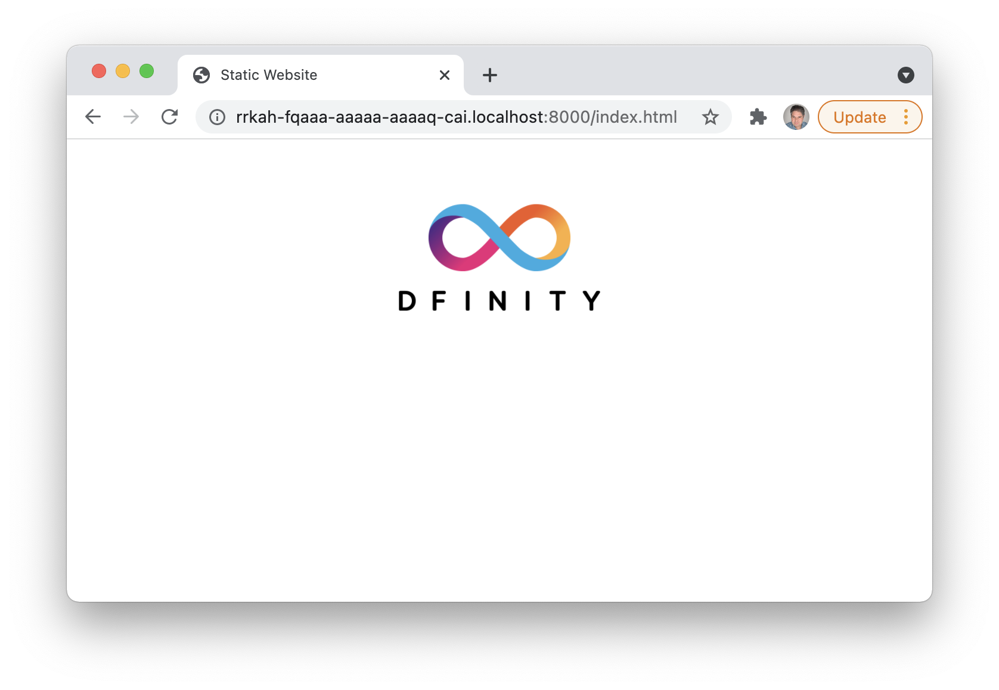
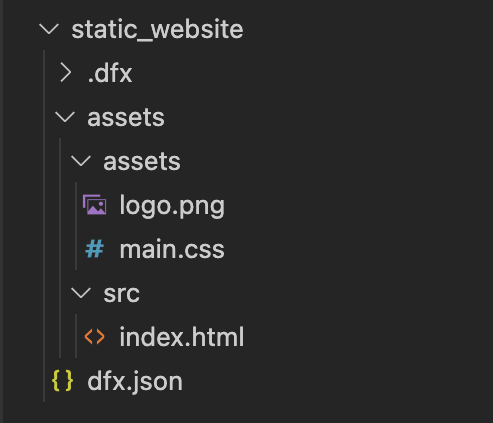

# Static website

[View this sample's code on GitHub](https://github.com/dfinity/examples/tree/master/hosting/static-website)

## Overview
The example shows how to deploy a simple, static website on the IC in an asset canister. The website is very simple, it just shows the DFINITY logo and has a basic styling of the logo. 



The purpose of this example is to show how to deploy a static website in an asset canister. While the website in this example is very simple, the method would be the same for a more advanced static website, e.g. based on popular static site generators.

This example covers:

- Build a very simple HTML website
- Create the dfx.json file
- Deploy the canister smart contract locally
- Test the frontend in browser 

## Prerequisites

This example requires an installation of:

- [x] Install the [IC SDK](https://internetcomputer.org/docs/current/developer-docs/setup/install/).

- [x] Download and install [git](https://git-scm.com/downloads).

### Install
Install the example dapp project:

```bash
git clone https://github.com/dfinity/examples
cd examples/hosting/static-website
```

## Documentation
There are two parts in this dapp. One is the website and the other is `dfx.json`. Since there's no backend, there is not any benefit of using the `dfx new project_name` command to set up a template. The `dfx.json` file is all that is needed.

### Website
The website is simple. It consists of an HTML file, a CSS file and a PNG file. The content of the HTML file looks like this:

```html
<!doctype html>
<html lang="en">
    <head>
        <meta charset="UTF-8">
        <meta name="viewport" content="width=device-width">
        <title>Static Website</title>
        <base href="/">
        <link type="text/css" rel="stylesheet" href="styles.css" />
    </head>
    <body>
        
    </body>
</html>
```

The only styling done in the CSS file is aligning the logo image:

```css
img {
    max-width: 50vw;
    max-height: 25vw;
    display: block;
    margin: auto;
}
```

The project folder will then look like this:



### dfx.json
The `dfx.json` file is a configuration file which specifies the canister used for the dapp. In this case only one canister is needed, and besides the canister configuration, `dfx.json` also includes information about DFX version, build settings and network settings.

```json
{
    "canisters": {
        "www": {
            "frontend": {
                "entrypoint": "assets/src/index.html"
            },
            "source": [
                "assets/assets",
                "assets/src"
            ],
            "type": "assets"
        }
    },
    "defaults": {
        "build": {
            "args": "",
            "packtool": ""
        }
    },
    "networks": {
        "local": {
            "bind": "127.0.0.1:8000",
            "type": "ephemeral"
        }
    },
    "version": 1
}
```

This is all needed for creating a canister smart contract for hosting a static website on the IC.

## Deployment
The local replica is started by running:

```bash
dfx start --background
```

When the local replica is up and running, run this command to deploy the canisters:

```bash
dfx deploy
```


## Testing
The URL for the frontend depends on the canister ID.  Local canister IDs can be obtained using `dfx canister id`, in this case `dfx canister id www`. When deployed, the URL will look like this:

**http://\{ui_canister_id\}.localhost:8000**


## License
This project is licensed under the Apache 2.0 license, see `LICENSE.md` for details. See `CONTRIBUTE.md` for details about how to contribute to this project. 
