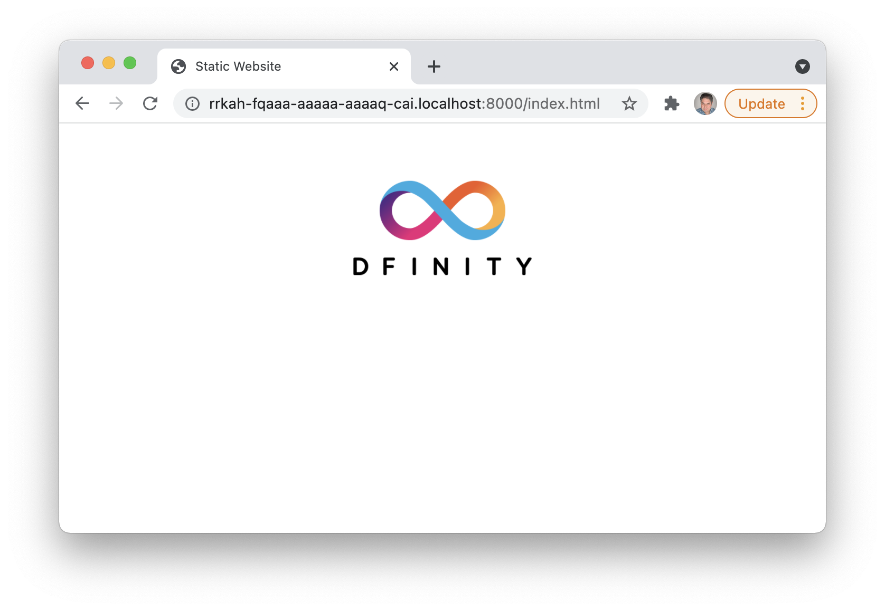

# Static website

## Overview

The example shows how to deploy a simple, static website hosted on ICP. The website is very simple; it just displays the DFINITY logo. While the website in this example is very simple, the method would be the same for a more advanced static website, e.g., based on popular static site generators.



## Project structure

The website consists of an HTML file, a CSS file, and a PNG file:

```
static-website
├── icp.yaml
└── frontend
    ├── assets
    │   ├── logo.png
    │   └── main.css
    └── src
        └── index.html
```

[`icp.yaml`](icp.yaml) is the icp-cli project file. It defines the single canister this dapp needs — a `frontend` canister on the `@dfinity/static-site` recipe — together with the build steps that assemble the site into `dist/`.

## Prerequisites

- [x] Install [icp-cli](https://cli.icp.build): `npm install -g @icp-sdk/icp-cli @icp-sdk/ic-wasm`

## Install

Clone the example project:

```bash
git clone https://github.com/dfinity/examples
cd examples/hosting/static-website
```

## Deployment

Start the local network:

```bash
icp network start -d
```

Deploy the canisters:

```bash
icp deploy
```

`icp deploy` prints the frontend URL. On the local network it is derived from the canister name:

```
http://frontend.local.localhost:8000
```

Stop the local network when done:

```bash
icp network stop
```
