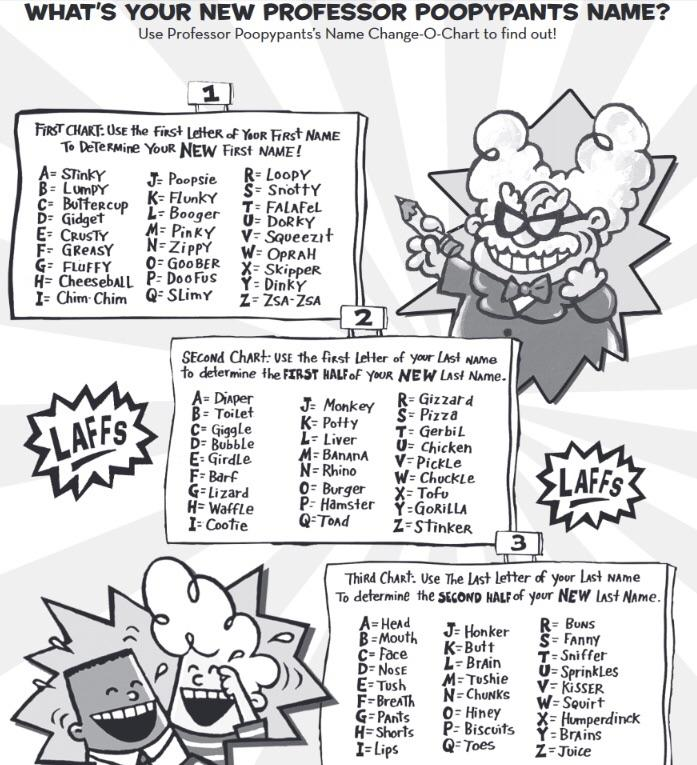

# Change-O-Chart 2000

This program provides a working implementation of the epic Professor Poopypants Change-O-Chart 2000 from the Captain Underpants novels. Enter your existing name and receive a brand new one according to the following chart.



### Prerequisites

You have downloaded and installed the SDK as described in [Getting started](https://sdk.dfinity.org/developers-guide/getting-started.html).

### Demo

Start a local internet computer.

```bash
dfx start
```

Execute the following commands in another tab.

```bash
dfx build
dfx canister install --all
```

Send your "old" name and receive your new one.

```bash
dfx canister call changeochart2000 translate '("John Doe")'
```
