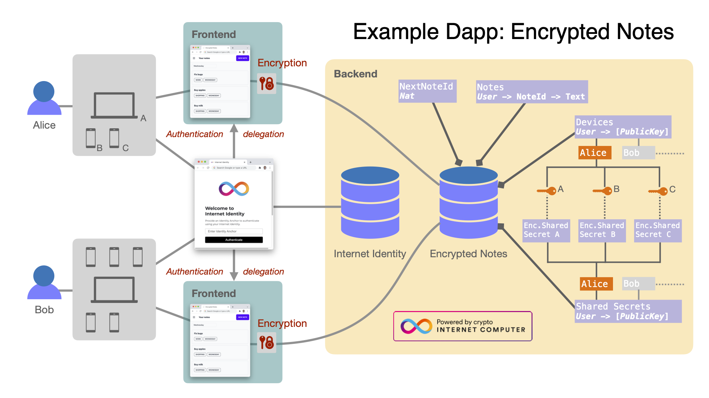
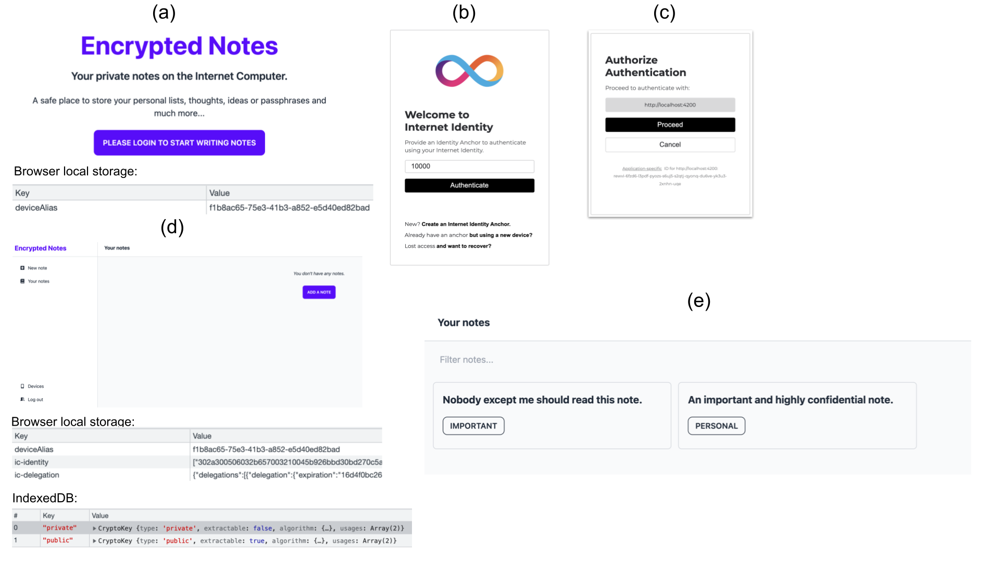
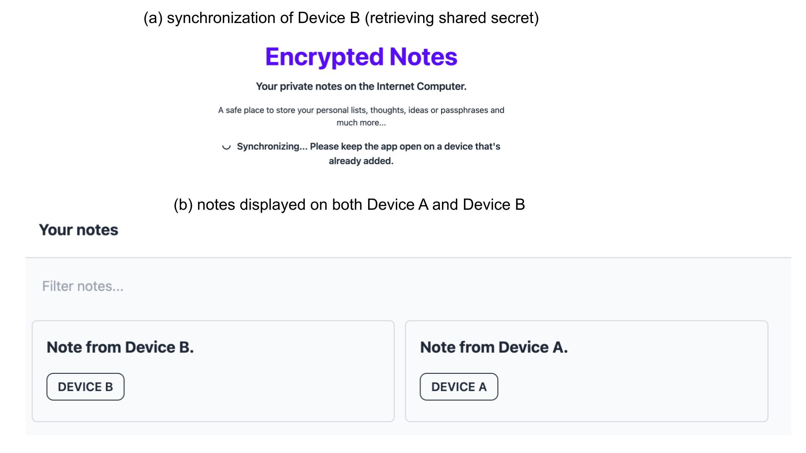
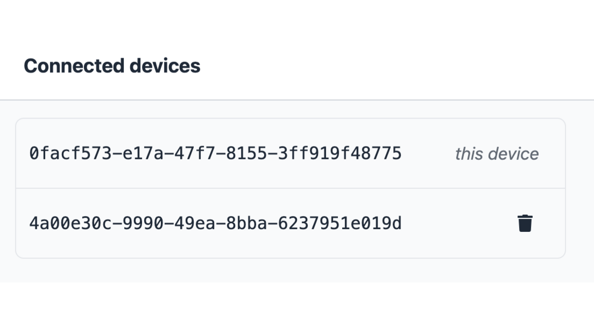

#### Content

- [Encrypted notes](#encrypted-notes)
- [Disclaimer: please read carefully](#disclaimer-please-read-carefully)
- [Deployment](#deployment)
  - [Selecting backend canister deployment option](#selecting-backend-canister-deployment-option)
  - [Local deployment](#local-deployment)
    - [Option 1: Docker deployment](#option-1-docker-deployment)
    - [Option 2: Manual deployment](#option-2-manual-deployment)
  - [Mainnet deployment](#mainnet-deployment)
- [User interaction with "Encrypted Notes" dapp](#user-interaction-with-encrypted-notes-dapp)
  - [Scenario I: basic single-device usage](#scenario-i-basic-single-device-usage)
  - [Scenario II: user is accessing notes from multiple devices](#scenario-ii-user-is-accessing-notes-from-multiple-devices)
  - [Scenario III: device management](#scenario-iii-device-management)
- [Unit testing](#unit-testing)
- [Troubleshooting](#troubleshooting)
  - [Building/deployment problems](#buildingdeployment-problems)
  - [Login problems](#login-problems)
- [dfx.json file structure](#dfxjson-file-structure)
- [Local memory model](#local-memory-model)
- [Further Reading](#further-reading)
- [Acknowledgments](#acknowledgments)
## Encrypted notes

Encrypted Notes is an example dapp for authoring and storing confidential information on the Internet Computer (IC) in the form of short pieces of text. Users can create and access their notes via any number of automatically synchronized devices authenticated via [Internet Identity (II)](https://smartcontracts.org/docs/ic-identity-guide/what-is-ic-identity.html). Notes are stored confidentially thanks to the end-to-end encryption performed by the dapp’s frontend.

This project serves as a simple (but not too simple) example of a dapp, which uses Motoko and Rust as backend and Svelte as frontend.

<p align="center">
  
</p>
<p align = "center">
Fig.1. Architectural overview of the Encrypted Notes dapp using client-side end-to-end encryption.
</p>

---
&nbsp;

## Disclaimer: please read carefully

This is an _example dapp_ that demonstrates the potential of building _canisters_ for the IC. Please do not use this code in production and/or scenarios in which sensitive data could be involved. While this dapp illustrates end-to-end encryption, there are **several open security issues** that should be addressed before the dapp could be considered production-ready:

- The frontend re-uses the generated public- and private-key pair for every identity in the same browser. In a better implementation, this key pair should be unique per principal.
- The public/private key pair should not be managed by the web browser at all. [WebAuthn](https://en.wikipedia.org/wiki/WebAuthn) should be used to push the key management to the operating system.
- Integer overflows are possible in the Rust canister, e.g., for `NEXT_NOTE`. 
- Users may lose their notes if they accidentally clean the browser data (localStorage) while no other device is synced to the dapp.
- Lack of key update: Given that the key used to encrypted the notes is never refreshed, the privacy of the data is no longer guaranteed if an attacker learns this key (for instance, by corrupting the local storage in one of the connected devices).

---
&nbsp;

## Deployment
### Selecting backend canister deployment option
* For **Motoko** deployment run:
  ```sh
  export BUILD_ENV=motoko
  ```

* For **Rust** deployment run:
  ```sh
  export BUILD_ENV=rust
  ```

   _Note_: Building the Rust canister requires either the Rust toolchain installed on your system or Docker-backed deployment (see below). 

---
&nbsp;

### Local deployment
#### Option 1: Docker deployment

_Note_: this option does not yet work on Apple M1; the combination of [DFX](https://smartcontracts.org/docs/developers-guide/cli-reference/dfx-parent.html) and Docker do not currently support the required architecture.

1. Install and start Docker by following the [instructions](https://docs.docker.com/get-docker/).
2. For **Motoko** build/deployment set environmental variable:
   ```sh
   export BUILD_ENV=motoko
   ```
3. Run the following Bash script that builds a Docker image, compiles the canister, and deploys this dapp (all inside the Docker instance):
   ```sh
   sh ./deploy_locally.sh
   ```
4. To open the frontend, go to http://localhost:3000/


#### Option 2: Manual deployment
1. For **Motoko** deployment set environmental variable:
   ```sh
   export BUILD_ENV=motoko
   ```
2. To generate `$BUILD_ENV`-specific files (i.e., Motoko or Rust) run:
   ```sh
   sh ./pre_deploy.sh
   ```
3. [Install DFX](https://sdk.dfinity.org/docs/quickstart/local-quickstart.html). Please keep in mind the dfx cli currently only runs on Linux and Apple based PCs.
4. Install npm packages from the project root:
   ```sh
   npm install
   ```
   _Note_: see [Troubleshooting](#troubleshooting) in case of problems
5. In case DFX was already started before run the following:
   ```sh
   dfx stop
   rm -rf .dfx
   ```
6. Run in a separate shell (it blocks the shell):
   ```sh
   dfx start --clean
   ```
7. Install a local [Internet Identity (II)](https://smartcontracts.org/docs/ic-identity-guide/what-is-ic-identity.html) canister:
   _Note_: If you have multiple dfx identities set up, ensure you are using the identity you intend to use with the `--identity` flag.
   1. To install and deploy a canister run:
      ```sh
      dfx deploy internet_identity --argument '(null)'
      ```
   2. To print a URL run:
      ```sh
      npm run print-dfx-ii
      ```
   3. Visit the URL from above and create at least one local internet identity.
8. Deploy the encrypted notes backend canister:
   ```sh
   dfx deploy "encrypted_notes_$BUILD_ENV"
   ```
9. Update the generated canister interface bindings: 
   ```sh
   dfx generate "encrypted_notes_$BUILD_ENV"
   ```
10. Deploy the frontend canister:
    1. To install and deploy the canister run:
       ```sh
       dfx deploy www
       ```
    2. To print a URL run: 
       ```sh
       npm run print-dfx-www
       ```
    3. Visit the URL from above
11. To get the frontend with hot-reloading on [http://localhost:3000/](http://localhost:3000/) run:****
    ```sh
    npm run dev
    ```
---
&nbsp;

### Mainnet deployment
_Note_: Prior to starting the mainnet deployment process, ensure you have your identities and wallets set up for controlling the canisters correctly. This guide assumes that this work has been done in advance. [More info here](https://smartcontracts.org/docs/developers-guide/cli-reference/dfx-identity.html).

1. Create the canisters:
   ```sh
   dfx canister --network ic create "encrypted_notes_${BUILD_ENV}"
   dfx canister --network ic create www
   ```
    _Note_: `encrypted_notes_rust` will only work if you have the Rust toolchain installed.
2.  Build the canisters:
      ```sh
      dfx build "encrypted_notes_${BUILD_ENV}" --network ic
      dfx build www --network ic
      ```

3.  Deploy to mainnet:
      _Note_: In the commands below, `--mode` could also be `reinstall` to reset the [stable memory](https://smartcontracts.org/docs/language-guide/upgrades.html).

      ```sh
      dfx canister --network ic install "encrypted_notes_${BUILD_ENV}" --mode=upgrade
      dfx canister --network ic install www --mode=upgrade
      ```

---
&nbsp;
## User interaction with "Encrypted Notes" dapp

### Scenario I: basic single-device usage

<p align="center">
  
</p>
<p align = "center">
Fig. 2. Basic single-device scenario for a user.
</p>

1. Open the main page of the `Encrypted Notes` dapp. You will see a _login_ button.

   1. If deployed locally, visit the following link: http://localhost:8000?canisterId=rkp4c-7iaaa-aaaaa-aaaca-cai
   2. If deployed to the mainnet IC, visit the corresponding canister URL.

   At this moment, only one _deviceAlias_ variable is stored in the _Local Storage_ (see Fig. 2(a)).

   _Note_: see [Troubleshooting](#troubleshooting) in case of problems.

2. Click the "Login" button. You will be redirected to the _Internet Identity_ canister (see Fig. 2(b)).

   1. If you already have an `anchor`, you may continue with it. Click "Authenticate", then verify your identity and finally click "Proceed", see Fig. 2(c).
   2. If you do not have an anchor yet, you should [create one](https://smartcontracts.org/docs/ic-identity-guide/auth-how-to.html). Once an `anchor` is created, please follow 2.1.

3. Once logged in for the first time, your notes list should be empty. At this moment, your _Local Storage_ should be populated with additional variables (see Fig. 2(d)): **ic-identity**, **ic-delegation**. These variables are used for storing/retrieving notes from the backend canister. In addition, another two variables are generated in the _IndexedDB_: **PrivateKey**, **PublicKey**. These two variable are used for encrypting/decrypting the shared secret key.
4. Create/edit/delete notes and observe changes in the resulting notes list (see Fig. 2(e)).

### Scenario II: user is accessing notes from multiple devices

In this scenario, a user accesses the dapp using the same _Internet Identity_ anchor from multiple devices. From our dapp's perspective, each web browser instance can be viewed as a separate device.

<p align="center">
  
</p>
<p align = "center">
Fig. 3. Scenario for a user with multiple registered devices.
</p>

1. Perform steps 1-3 of Scenario I on Device A.
2. Perform steps 1-3 of Scenario I on Device B. One subtle difference that you might observe on Device B is that the message "Synchronizing..." (Fig. 3(a)) appears for a short period of time. As Device A was the first to login, it was also the first one to generate a shared secret. Device B has to retrieve it. In order to do that, Device B first uploads its public key (pub B) to the backend canister. Device A retrieves pub B by means of periodic polling. Device A then re-encrypts the shared secret with pub B and uploads it to the backend. Afterwards, Device B can retrieve the encrypted shared secret and decrypt it with its private key.
3. Observe that the list of notes is now empty for both devices.
4. Create a Note, e.g. "Note from Device A" on Device A, and observe it on Device B.
5. Analogously, create a different note, e.g. "Note from Device B" on Device B.
6. Confirm that the notes are synchronized between the two devices.

### Scenario III: device management

<p align="center">
  
</p>
<p align = "center">
Fig. 4. Scenario for a user adding/removing devices.
</p>

1. Login into the dapp with the same anchor on two or more devices.
2. On each device, navigate to "Devices" item in the menu.
3. Observe that the list of registered devices contains as many entries as the number of logged in devices.
4. Assuming we are using Device A, click "remove" for some other device, say, Device B.
5. While still on Device A, observe that Device B is deleted from the list of devices. _Note_: a device cannot remove itself. That is why you do not see a "remove" button for your current device.
6. Switch to Device B and observe that it has been logged out.
7. Login with Device B again and observe in "Device" tab both devices again.

---
&nbsp;

## Unit testing

This project demonstrates how one can write unit tests in Motoko. The unit tests are implemented in `src/encrypted_notes_motoko/test/test.mo` using the [Motoko Matchers](https://kritzcreek.github.io/motoko-matchers/) library. 

The easiest way to run all tests involves three steps: 
1. Follow the [above instructions](#option-1-docker-deployment) for Deployment via Docker.
2. Open a new console, type `docker ps`, and copy the `"CONTAINER ID"` of the `encrypted_notes` image; save it into `DOCKER_IMAGE`.
3. Run: 
   ```sh
   docker exec $DOCKER_IMAGE sh src/encrypted_notes_motoko/test/run_tests.sh
   ```

One can also run unit tests locally via:
```sh
src/encrypted_notes_motoko/test/run_tests.sh
```
However, this requires installing [`wasmtime`](https://wasmtime.dev/) and [`motoko-matchers`](https://github.com/kritzcreek/motoko-matchers). See the contents of `src/encrypted_notes_motoko/test/run_tests.sh` for more detail. 

---
&nbsp;

## Troubleshooting
### Building/deployment problems
Error `ERR_OSSL_EVP_UNSUPPORTED`.
Version 17+ of node.js introduces changes to the way Node handles OpenSSL.
This can cause conflicts with certain dependencies that require the old behavior.

Possible Remedies:
1. `export NODE_OPTIONS=--openssl-legacy-provider` (tested with node 17+)
2. Regress node version to 16.13.2 LTS (untested)

### Login problems
Some errors like `Could not initialize crypto service` might occur due to browser caching issues. Redeployment of the dapp can cause such problems. In this case clear browser's _Local Storage_ and _IndexedDB_.

## dfx.json file structure
`dfx.json` is the configuration of the project when deploying to either the local replica or to the IC, it assists in the creation of the `.dfx` directory (which contains `canister_ids.json` — which merely maps canister by name to their id on both local replica and the IC). There are various configuration options here and this is not exhaustive. This will primarily discuss target types for canisters (which all exist under the `canisters` key).

```sh
{
    "canisters": {
        "encrypted_notes_motoko": {
            "main": "src/encrypted_notes_motoko/main.mo",
            "type": "motoko"
        },
        "encrypted_notes_rust": {
            "type": "custom",
            "build": "cargo build --target wasm32-unknown-unknown --package encrypted_notes_rust --release",
            "wasm": "target/wasm32-unknown-unknown/release/encrypted_notes_rust.wasm",
            "candid": "src/encrypted_notes_rust/src/encrypted_notes_rust.did"
        },
        "www": {
            "dependencies": ["encrypted_notes_motoko"],
            "frontend": {
                "entrypoint": "src/frontend/public/index.html"
            },
            "source": ["src/frontend/public/"],
            "type": "assets"
        },
        "internet_identity": {
            "candid": "internet_identity.did",
            "type": "custom",
            "wasm": "internet_identity.wasm"
        }
    },
    "dfx": "0.8.4",
    "networks": {
        "local": {
            "bind": "0.0.0.0:8000",
            "type": "ephemeral"
        }
    },
    "version": 1
}
```
**encrypted_notes_motoko**:
Motoko is the IC-specific language for building and deploying Canisters. Two keys are necessary:
`main`: The directory location of the entrypoint file of your canister.
`type`: needs to be "motoko", informing dfx of how to properly build the canister.

**encrypted_notes_rust**:
Rust natively supports WebAssembly — the binary format of the Internet Computer, and there is a crate ic_cdk which allows hooks into the IC. Unlike motoko, DFX does not yet have a native Rust target that infers as much as motoko canisters. So the keys that need to be provided are:
`type`: custom (letting dfx know that it's going to need to do some user-defined work)
`build`: whatever command needed to turn your project into a wasm binary. In this repo it's:
```sh
cargo build --package encrypted_notes_rust --target wasm32-unknown-unknown --release
```
`wasm`: wherever the wasm binary ends up at the end of the "build" command.
`candid`: There is not yet Rust autogeneration for candid IDL built into dfx, so DFX needs to know where you candid file for the canister built by "build" resides.
**www**:
frontend www canister (an "asset" canister) is the way we describe a set of files or a static website that we are deploying to the IC. Our project frontend is built in [Svelte](https://svelte.dev/). The keys we used are as follows:
`dependencies`: an array of whatever canisters are being used to serve your app, to ensure that dfx builds and deploys them before your app.
`frontend: { entrypoint: ""}`: This set of keys tells dfx to build it as a frontend canister, and entrypoint is wherever your app entrypoint winds up residing at the end of an npm build
`source`: where the rest of your app resides at the end of npm build
`type`: "assets" for an assets or static canister.  

**Binary targets**:
You can also just deploy arbitrary binary targets as long as they're wasm binaries. For that we use the keys:
`wasm`: a wasm file.
`candid`: a candidfile representing all interfaces in the wasm file.

_Note_: If there is a mismatch between "wasm" and "candid" interface definitions, your canister will not deploy.

---
&nbsp;

## Local memory model

_Note_: This dapp uses the web browser's _Local Storage_ and _IndexedDB_ for storing the following data:

- device name
- user identity info
- a private/public key pair

A symmetric key for encrypting/decrypting the notes is stored in RAM (this key is shared between multiple devices). For a better understanding of the mechanics of the dapp, please see the _Local Storage_/_IndexedDB_ windows in your web browser. In Chrome, go to: _Developer Tools→Application→Local Storage_/_IndexedDB_.

---
&nbsp;


## Further Reading
To learn more about working with `dfx`, see the following online documentation:

- [Quick Start](https://sdk.dfinity.org/docs/quickstart/quickstart-intro.html)
- [SDK Developer Tools](https://sdk.dfinity.org/docs/developers-guide/sdk-guide.html)
- [Motoko Programming Language Guide](https://sdk.dfinity.org/docs/language-guide/motoko.html)
- [Motoko Language Quick Reference](https://sdk.dfinity.org/docs/language-guide/language-manual.html)
- [JavaScript API Reference](https://erxue-5aaaa-aaaab-qaagq-cai.raw.ic0.app)

---
&nbsp;

## Acknowledgments
We thank the author of [IC Notes](https://github.com/pattad/ic_notes) whose code was the starting point for the frontend component used in this project.

We thank the authors of [IC Vault](https://github.com/timohanke/icvault) whose code was the starting point for this project's backend, browser-based encryption, and device management.
