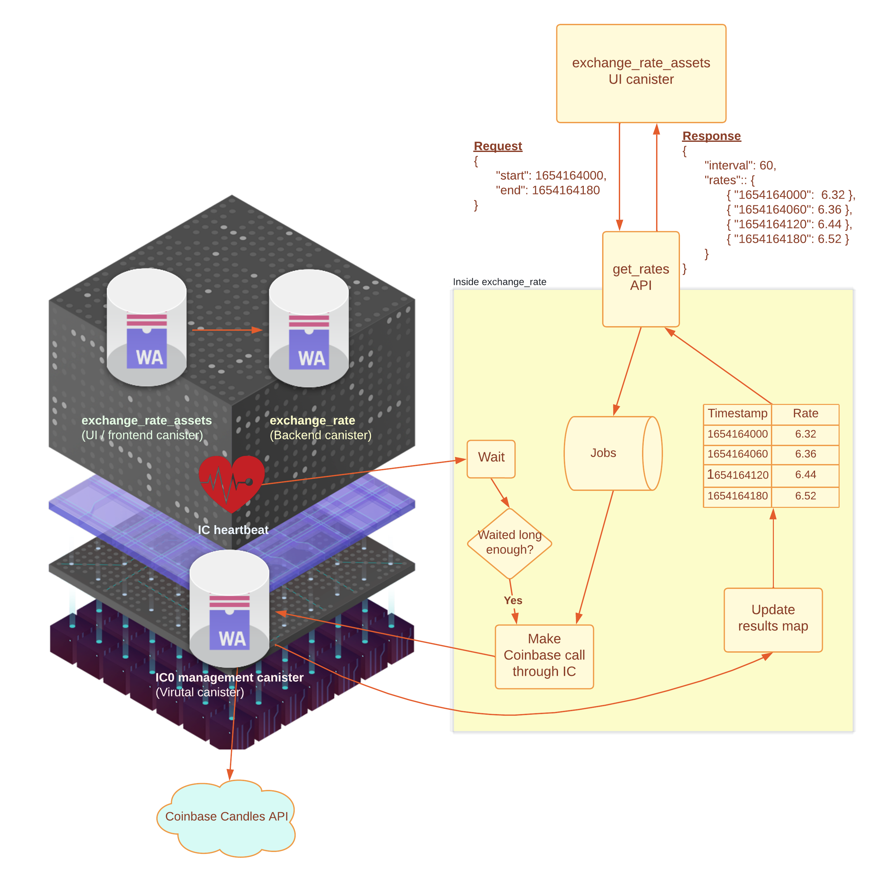

# Using HTTPS outcalls to fetch exchange rates

## Overview

The [HTTPS outcalls](/https-outcalls) feature provides a way for canisters to directly interact with web services that exist outside of the Internet Computer in the Web 2.0 world. The Exchange Rate sample dapp pulls ICP/USDC exchange rates from a single provider – [Coinbase](https://docs.cloud.coinbase.com/exchange/reference/exchangerestapi_getproductcandles). The sample dapp provides an example of using the [HTTPS outcalls API](/docs/current/references/ic-interface-spec#ic-http_request) implemented in [Motoko](https://github.com/dfinity/examples/tree/master/motoko/exchange_rate)
 and [Rust](https://github.com/dfinity/examples/tree/master/rust/exchange_rate).

### What does the sample dapp do?

**TL;DR: the sample dapp is just an unbounded time series cache.**

There are two parts to the sample dapp:
1. The frontend UI canister `exchange_rate_assets`, which includes a time range picker and a rate chart.
2. The backend provider canister `exchange_rate` that performs HTTPS outcalls, queues jobs, transforms responses, etc.

The backend canister receives an update request corresponding to the time range specified by the user at the frontend. The time range
is converted into time buckets and the buckets are queued for retrieval. Asynchronously at every few Internet Computer heartbeats,
the backend canister makes a Coinbase API request for a single queued time bucket. Each request to Coinbase pulls at most 200 data points from Coinbase, which is less than the limit of 300 which Coinbase has. The dapp uses a time series granularity of 60 seconds, so each HTTPS request to
Coinbase covers a time bucket of at most 200 minutes. The fetched data points are then put into a global timestamp-to-rate hashmap.

If the time range the user requested is longer than a couple of years, the size of data to be returned by the backend `exchange_rate`
canister could exceed the existing limits of the system. As a result, the `exchange_rate` canister may return data points with increased granularity in order to fit into the limits and
cover the full requested range.

## Architecture


## How to use the sample dapp

Users should be able to interact only with the frontend UI canister by selecting the start time 
and the end time with the datetime pickers.

The returned rates may not exactly match the user's time selection. There could be gaps between
data points or there could be a smaller range being returned. The reason is that to respect rate limiting
on the remote service, we fetch data from the remote service once every few IC heartbeats.
Consequently, pulling all requested rates can be a relatively long asynchronous operation. 

All the previously-pulled rates are stored in memory. As the user submits their requests, the rates that are
already available are returned, while the ones that are not yet available will be fetched eventually.
If the user spots gaps between requested rates and returned rates, the user needs to wait for some time and
retry the request, and likely the full set of rates will be available then.

## Cost analysis of the `exchange_rate` canister

There are 2 major factors affecting the [pricing](/docs/current/developer-docs/integrations/http_requests/http_requests-how-it-works#pricing) when it comes to the HTTPS outcalls feature:

* The number of requests.
* The size of each request and response.

If we need to fetch a longer period of rates then the number of external HTTPS outcalls is inversely proportional to the body size of each response.
This sample dapp minimizes the total number of HTTPS outcalls at the cost of bigger response bodies. 

## Building and deploying the sample dapp locally

### Prerequisites
- [x] [ic-cdk v0.6.5](https://crates.io/crates/ic-cdk/0.6.5) or above
- [x] [dfx v0.12.0](https://github.com/dfinity/sdk/releases/tag/0.12.0) or above.

 ### Step 1: Clone the sample dapp's GitHub repo:

```
git clone https://github.com/dfinity/examples.git
```

 ### Step 2: Navigate into the Motoko example directory for this project:

```
cd examples/motoko/exchange_rate
```

 ### Step 3: Deploy the canister locally:

```
./deploy.sh local
```

The output of this script will resemble the following:

```
Committing batch.
Deployed canisters.
URLs:
  Frontend canister via browser
    exchange_rate_assets: http://127.0.0.1:4943/?canisterId=bd3sg-teaaa-aaaaa-qaaba-cai
  Backend canister via Candid interface:
    exchange_rate: http://127.0.0.1:4943/?canisterId=be2us-64aaa-aaaaa-qaabq-cai&id=bkyz2-fmaaa-aaaaa-qaaaq-cai
```

