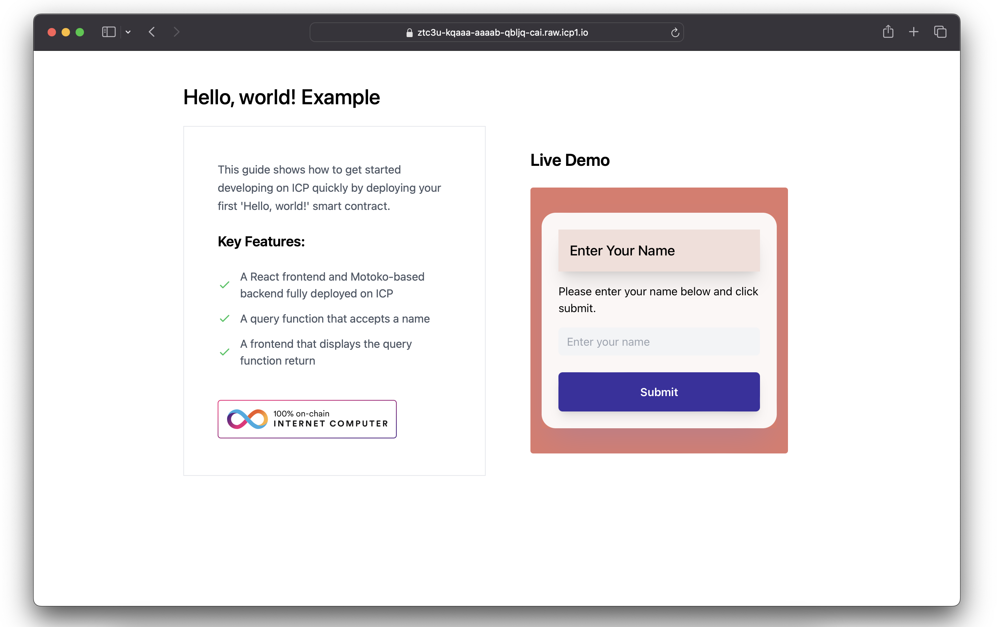

# Hello, world!

This simple example demonstrates how applications on ICP are structured using a backend smart contract and a frontend smart contract, and provides an introduction to the programming language Motoko.

This variation of "Hello, world!" is written in [Motoko](https://internetcomputer.org/docs/motoko/main/getting-started/motoko-introduction), a programming language designed specifically for developing canisters (referred to as **canisters**) on ICP.

## Project structure

The `/backend` folder contains the Motoko canister, `app.mo`. The `/frontend` folder contains web assets for the application's user interface. The user interface is written with plain JavaScript, but any frontend framework can be used.

Edit the `mops.toml` file to add [Motoko dependencies](https://mops.one/) to the project.

## Deploying from ICP Ninja

When viewing this project in ICP Ninja, you can deploy it directly to the mainnet for free by clicking "Deploy" in the upper right corner.
To open this project in ICP Ninja, click [here](https://next-icp.ninja/i?url=https://github.com/dfinity/examples/tree/master/motoko/hello_world).

To **download** or **reset** the project files, click the menu option next to the deploy button.

## Build and deploy from the command-line

To migrate your ICP Ninja project off of the web browser and develop it locally, follow these steps. These steps are necessary if you want to deploy this project for long-term, production use on the mainnet.

### 1. Download your project from ICP Ninja using the 'Download files' button on the upper left corner under the pink ninja star icon.

### 2. Open the `BUILD.md` file for further instructions.
