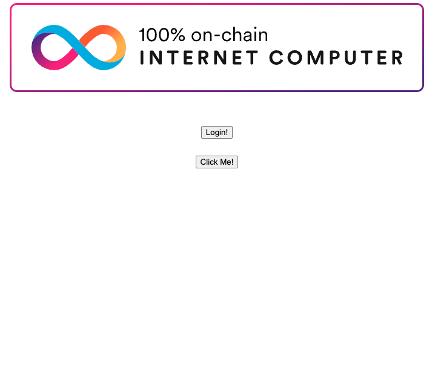

# Internet Identity integration sample

## Overview

This tutorial shows how to integrate Internet Identity into a dapp front-end and make use of the user identity in the backend. It builds on the "greet" dapp that is generated by running `dfx new`. If you are unfamiliar with `dfx new` and the generated application, please have a look at [this](https://internetcomputer.org/docs/current/developer-docs/setup/install/index.mdx) guide first.

The code contained in this folder shows the finished solution you should arrive at after following the step-by-step instructions.

This tutorial will explain all the steps required to integrate the default starter template (generated using `dfx new`) with Internet Identity. When finished, the dapp will do the following:

- Offer a login with Internet Identity button.
- Greet you with the principal provided by Internet Identity instead of entering a name.

This is a Motoko example that does not currently have a Rust variant. 


## Prerequisites
- [x] Install the [IC SDK](https://internetcomputer.org/docs/current/developer-docs/setup/install/index.mdx).
- [x] Install [Node.js](https://nodejs.org/en/download/).
- [x] Download and install the `@dfinity/auth-client` package with the command `npm install @dfinity/auth-client`. 
- [x] Download the following project files from GitHub: https://github.com/dfinity/examples/

### Step 1: Navigate into the examples folder for this sample and then generate a new project with `dfx new`:

```
cd examples/motoko/internet_identity_integration
dfx new greet
```


You should have a starter project generated with the following file structure:

```
├── README.md
├── dfx.json
├── package.json
├── src
│   ├── <name>_backend
│   │   └── main.mo
│   └── <name>_frontend
│       ├── assets
│       │   ├── favicon.ico
│       │   ├── logo2.svg
│       │   ├── main.css
│       │   └── sample-asset.txt
│       └── src
│           ├── index.html
│           └── index.js
└── webpack.config.js
```

### Step 2: Add Internet Identity to the local project.
Add this code block to the canister section in the `dfx.json` file:

**The following example is a **code snippet** that is part of a larger code file. This snippet may return an error if run on its own. To view the full code file that should be run, please see [final code](#final-code).**

```
"internet_identity": {
  "type": "custom",
  "candid": "https://github.com/dfinity/internet-identity/releases/latest/download/internet_identity.did",
  "wasm": "https://github.com/dfinity/internet-identity/releases/latest/download/internet_identity_dev.wasm.gz",
  "remote": {
    "id": {
      "ic": "rdmx6-jaaaa-aaaaa-aaadq-cai"
    }
  },
  "frontend": {}
}
```

This adds a prebuilt Internet Identity canister to your project. The remote property makes sure, that this canister is only deployed locally (as it already exists on mainnet). The frontend property tells dfx that this canister does have a front-end (so it prints the front-end URL after deployment, see the next step). The URLs point to the latest dev build release of Internet Identity. The dev build has some extra features that make Internet Identity easier to use in a development setting (such as a predictable captcha, no requirement for WebAuthn, etc.).

### Step 3: Deploy Internet Identity locally.
Run `dfx deploy` to deploy all canisters including Internet Identity to the local replica. It should print the Internet Identity URL to the console:

```
dfx deploy
```

If successful, your output will resemble the following:

```
...
Deployed canisters.
URLs:
  Frontend canister via browser
    greet_frontend: http://127.0.0.1:4943/?canisterId=ryjl3-tyaaa-aaaaa-aaaba-cai
    internet_identity: http://127.0.0.1:4943/?canisterId=r7inp-6aaaa-aaaaa-aaabq-cai
  Backend canister via Candid interface:
...
```

Open the `internet_identity` link in the browser. You should be able to create anchors and register devices.

### Step 4: Make the Internet Identity URL available in the build process.
We want the sample application to integrate with Internet Identity differently depending on whether we deploy locally or on mainnet:

- Locally the application should use the Internet Identity URL http://127.0.0.1:4943/?canisterId=<II_CANISTER_ID>.
- On the mainnet it should use https://identity.ic0.app.

To do so, we can make an environment variable II_URL available using webpack.

Open the `webpack.config.js` file and replace the contents with the following:

```
const path = require("path");
const webpack = require("webpack");
const HtmlWebpackPlugin = require("html-webpack-plugin");
const TerserPlugin = require("terser-webpack-plugin");
const CopyPlugin = require("copy-webpack-plugin");

const network =
    process.env.DFX_NETWORK ||
    (process.env.NODE_ENV === "production" ? "ic" : "local");
function initCanisterEnv() {
  let localCanisters, prodCanisters;
  try {
    localCanisters = require(path.resolve(
      ".dfx",
      "local",
      "canister_ids.json"
    ));
  } catch (error) {
    console.log("No local canister_ids.json found. Continuing production");
  }
  try {
    prodCanisters = require(path.resolve("canister_ids.json"));
  } catch (error) {
    console.log("No production canister_ids.json found. Continuing with local");
  }

  const canisterConfig = network === "local" ? localCanisters : prodCanisters;

  return Object.entries(canisterConfig).reduce((prev, current) => {
    const [canisterName, canisterDetails] = current;
    prev[canisterName.toUpperCase() + "_CANISTER_ID"] =
      canisterDetails[network];
    return prev;
  }, {});
}
const canisterEnvVariables = initCanisterEnv();

const isDevelopment = process.env.NODE_ENV !== "production";

const internetIdentityUrl = network === "local" ? `http://localhost:4943/?canisterId=${canisterEnvVariables["INTERNET_IDENTITY_CANISTER_ID"]}` : `https://identity.ic0.app`

const frontendDirectory = "greet_frontend";

const frontend_entry = path.join("src", frontendDirectory, "src", "index.html");

module.exports = {
  target: "web",
  mode: isDevelopment ? "development" : "production",
  entry: {
    // The frontend.entrypoint points to the HTML file for this build, so we need
    // to replace the extension to `.js`.
    index: path.join(__dirname, frontend_entry).replace(/\.html$/, ".js"),
  },
  devtool: isDevelopment ? "source-map" : false,
  optimization: {
    minimize: !isDevelopment,
    minimizer: [new TerserPlugin()],
  },
  resolve: {
    extensions: [".js", ".ts", ".jsx", ".tsx"],
    fallback: {
      assert: require.resolve("assert/"),
      buffer: require.resolve("buffer/"),
      events: require.resolve("events/"),
      stream: require.resolve("stream-browserify/"),
      util: require.resolve("util/"),
    },
  },
  output: {
    filename: "index.js",
    path: path.join(__dirname, "dist", frontendDirectory),
  },

  // Depending in the language or framework you are using for
  // front-end development, add module loaders to the default
  // webpack configuration. For example, if you are using React
  // modules and CSS as described in the "Adding a stylesheet"
  // tutorial, uncomment the following lines:
  // module: {
  //  rules: [
  //    { test: /\.(ts|tsx|jsx)$/, loader: "ts-loader" },
  //    { test: /\.css$/, use: ['style-loader','css-loader'] }
  //  ]
  // },
  plugins: [
    new HtmlWebpackPlugin({
      template: path.join(__dirname, frontend_entry),
      cache: false,
    }),
    new webpack.EnvironmentPlugin({
      NODE_ENV: "development",
      II_URL: internetIdentityUrl,
      ...canisterEnvVariables,
    }),
    new webpack.ProvidePlugin({
      Buffer: [require.resolve("buffer/"), "Buffer"],
      process: require.resolve("process/browser"),
    }),
    new CopyPlugin({
      patterns: [
        {
          from: `src/${frontendDirectory}/src/.ic-assets.json*`,
          to: ".ic-assets.json5",
          noErrorOnMissing: true
        },
      ],
    }),
  ],
  // proxy /api to port 4943 during development.
  // if you edit dfx.json to define a project-specific local network, change the port to match.
  devServer: {
    proxy: {
      "/api": {
        target: "http://127.0.0.1:4943",
        changeOrigin: true,
        pathRewrite: {
          "^/api": "/api",
        },
      },
    },
    static: path.resolve(__dirname, "src", frontendDirectory, "assets"),
    hot: true,
    watchFiles: [path.resolve(__dirname, "src", frontendDirectory)],
    liveReload: true,
  },
};
```

### Step 5: Add the auth-client library to the front-end.
The auth-client is a library provided by DFINITY to make integration with Internet Identity easy. Run:

```
npm install @dfinity/auth-client @dfinity/identity --save-dev
```

### Step 6: Add a login button to the front-end.
Open the `index.html` file and replace the content with the following:

```
<!DOCTYPE html>
<html lang="en">
  <head>
    <meta charset="UTF-8" />
    <meta name="viewport" content="width=device-width" />
    <title>greet</title>
    <base href="/" />
    <link rel="icon" href="favicon.ico" />
    <link type="text/css" rel="stylesheet" href="main.css" />
  </head>
  <body>
    <main>
      
      <br />
      <br />
      <form>
        <button id="login">Login!</button>
      </form>
      <br />
      <form>
        <button id="greet">Click Me!</button>
      </form>
      <section id="greeting"></section>
    </main>
  </body>
</html>
```

### Step 7: Make the login button interact with II.
In order for the login button to work, we need to give it behavior. Replace the contents of the `src/greet_frontend/src/index.js` file with the following:

```
import {createActor, greet_backend} from "../../declarations/greet_backend";
import {AuthClient} from "@dfinity/auth-client"
import {HttpAgent} from "@dfinity/agent";

let actor = greet_backend;

const greetButton = document.getElementById("greet");
greetButton.onclick = async (e) => {
    e.preventDefault();

    greetButton.setAttribute("disabled", true);

    // Interact with backend actor, calling the greet method
    const greeting = await actor.greet();

    greetButton.removeAttribute("disabled");

    document.getElementById("greeting").innerText = greeting;

    return false;
};

const loginButton = document.getElementById("login");
loginButton.onclick = async (e) => {
    e.preventDefault();

    // create an auth client
    let authClient = await AuthClient.create();

    // start the login process and wait for it to finish
    await new Promise((resolve) => {
        authClient.login({
            identityProvider: process.env.II_URL,
            onSuccess: resolve,
        });
    });

    // At this point we're authenticated, and we can get the identity from the auth client:
    const identity = authClient.getIdentity();
    // Using the identity obtained from the auth client, we can create an agent to interact with the IC.
    const agent = new HttpAgent({identity});
    // Using the interface description of our webapp, we create an actor that we use to call the service methods.
    actor = createActor(process.env.GREET_BACKEND_CANISTER_ID, {
        agent,
    });

    return false;
};%                              
```

### Step 8: Modify the back-end.
We want our application to greet the caller principal. In order to do so, the back-end Motoko code needs to be changed to:

- No longer take a name parameter.
- Use the `message.caller` for the greeting.

Replace the content of `src/greet_backend/main.mo` with the following:

```
import Principal "mo:base/Principal";

actor {
  public query (message) func greet() : async Text {
    return "Hello, " # Principal.toText(message.caller) # "!";
  };
};
```

### Step 9: Run `dfx deploy` again. This will also regenerate the bindings in `src/declarations`.

The successful output should resemble the following:

```
Deployed canisters.
URLs:
  Frontend canister via browser
    greet_frontend: http://127.0.0.1:4943/?canisterId=gx2xg-kmaaa-aaaaa-qaasq-cai
    internet_identity: http://127.0.0.1:4943/?canisterId=g6z42-4eaaa-aaaaa-qaata-cai
  Backend canister via Candid interface:
    greet_backend: http://127.0.0.1:4943/?canisterId=gf4a7-g4aaa-aaaaa-qaarq-cai&id=gq3rs-huaaa-aaaaa-qaasa-cai
    internet_identity: http://127.0.0.1:4943/?canisterId=gf4a7-g4aaa-aaaaa-qaarq-cai&id=g6z42-4eaaa-aaaaa-qaata-cai
```

### Step 10: Test the application.

Open the `greet_frontend` URL in a web browser. 



You should be able to observe the following behavior:

- If you press the "Click me!" button without logging in first, you should be greeted by the anonymous principal (2vxsx-fae).
- If you log in with Internet Identity, you should get a different principal.
- Using the same anchor multiple times should always yield the same principal.
- Using a different anchor will result in different principals.