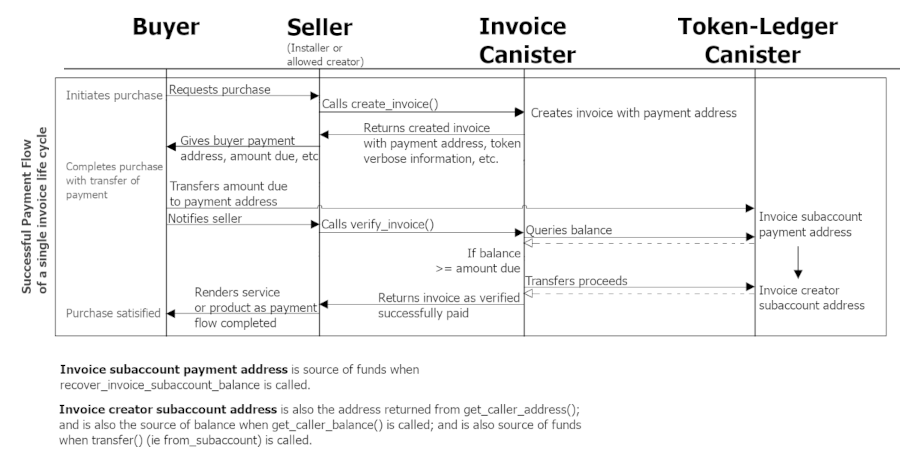

# Payments - Invoice Canister  

ㅤAs the Internet Computer becomes more capable, both within its own ecosystem as well as in connecting to not only the yet to be blockchained powered web, but also in directly signing to the smart contracts of other blockchains, we look to refine the developer experience around payments in canisters.  

ㅤWe concluded that requiring a developer to always handle all the "low level" operations necessary for interfacing to either the ICP ledger canister or any ICRC1 token-ledger canister just to process a transaction using one of those tokens is counter-productive to everyone's interest and time.  

ㅤFor example, a canister that would like to access or implement a payment system would need to implement from scratch things like protection against double spending, conversion to and from and validation of each kind of address format, or the multi-step token-canister ledger specific, and potentially trapping, intercanister calls necessary for the accounting of payments. For that reason and motivated by the expectation a developer's toolset should simply be reliably effective, we propose to design an interface that will make it easier for a typical canister to integrate payment functionality.  

## Goals  

Goals for this project are as follows:   

1. Solution should be simple to include and develop against locally.  
2. Canister should have at least some access control so that different callers can be authorized to use its service methods.  
3. Canister should be capable of easily checking the balance of an authorized caller.  
4. Canister should be capable of verifying a payment has been satisfied in either ICP or a token of the ICRC1 standard.  
5. Canister should be capable of reliably transferring funds that it holds on behalf of an authorized caller.  
6. Canister should be capable of also recovering funds from the subaccounts it creates on behalf of its authorized callers.  
7. Canister should accept different address formats as if they were the same so fewer steps are required of callers to process or relay transactions.  
8. Canister's interface for connecting to other token-ledger canisters should be standardized so supporting additional ICRC1 tokens is as simple.  
9. This design standard should also be compatible with BTC, ETH and other token-ledgers as they become available.  

## Getting to Know the Invoice Canister  
#### and the Choices of its Design  
##### Premise   

ㅤThe goal here is to design a flow where a client application such as a webpage could initiate a payment flow that could be used to gate services or transfer ownership of assets with as few canister calls as possible. 

ㅤIn this codebase and in the rest of this document, whenever the term 'API' is used, it is used to mean the `shared` methods of the Invoice Canister. Whenever the term 'address' is used, it means the source or destination of funds sent or received. While the naming strategy for fields, variables, methods and files may be a bit verbose, it is intended to make as much of this codebase as unambiguous as possible. 

##### Access Control as a Starting Point  

ㅤThe Invoice Canister will provide a standard API for each authorized caller without any special privileges to a specific caller if possible. As the question of access control can easily become complicated, to provide a starting point for developers to integrate a payment flow, the original deployer or canister installer retains the permission to add and remove principals from a list of allowed creators. Any caller whose principal is on this list will have the same permission of access in calling on the Invoice Canister[^1]. 

ㅤAn analogy that might be useful is that the installer is like an administrator, while allowed creators are like the staff (there's even a Motoko library for just this kind of thing[^2]). While not implemented currently, explicitly declaring a field at the Invoice Canister's actor scope to set a principal as the designated or delegated administrator (or making it mutable so it can be dynamically assigned; or even as a list of select principals) could be a useful addition. For instance a developer who wanted to provide development operations management and technical support to a web storefront looking to integrate crypto payments could set their command and control canister's id as this delegated administrator principal and then add all the sellers from that storefront to that invoice canister's allowed creators list. 

ㅤAlternatively that delegated administrator could be set as the principal of the controller of a DAO if the idea is to black-hole the Invoice Canister so it can perform as a decentralized payment processor. If this the case, it brings up an important and critical point to be aware of: *all funds managed by the Invoice Canister, until they are transferred out of its custody, could be either misappropriated by the canister's installer (or if changed, the current controller) or even irrecoverably lost if the Invoice Canister is black-holed*. That being said, with the current API any transfer of funds is only possible for funds that are linked to a specific authorized caller or the invoices that they create or are associated with (that is, their principal is on one of the invoice's permissions list).

##### Equally Authorized Caller Representation of an Invoice's Permissions     

ㅤThe Invoice Canister acts as the custodian of funds its processes for each of its authorized callers independently from all the other callers. Other than the three API methods associated with adding or removing or getting the allowed creators list:

* `add_allowed_creator()`   
* `remove_allowed_creator()`   
* `get_allowed_creators_list()`   
  
all other API calls work the same for each authorized caller. This is even true for the canister's installer: for example it is not possible for the canister installer to use any of the existing API methods to arbitrarily transfer funds from any of the addresses the Invoice Canister controls. 

ㅤThis is equally true for the other allowed creators as well. Each allowed creator has the same permission of access only to the invoices they create and the funds that end up in the Invoice Canister's custody as the result of those invoices. They also have the same authorization to add access control per invoice they create: specifically, the creation of an invoice allows for two lists to be included of no more than 256 principals each, such that one grants authorization for callers who can get that same invoice (`canGet`), and the other authorizes callers who can verifying that invoice or recover funds associated with its payment address (`canVerify`). 

ㅤIn other words only authorized callers can create invoices. For each invoice created, only callers authorized to either get or verify that invoice, other than the invoice's creator, can all the related Invoice Canister's API methods successfully. This is equally true for the invoice canister installer as is the code currently implemented. This is the extent of built-in access control the Invoice Canister provides[^3]. 

##### The Extent of an Invoice's Privacy    

ㅤWhile it is true an invoice is protected from unauthorized callers as exampled above, it is important to be aware of the fact invoice records, in particular the `meta` and `description` `details` fields, as they are saved in the memory of an invoice canister, are not by default encrypted or otherwise impervious to physical inspection by a node provider. If such privacy is needed, consider implementing a cryptographic strategy for encrypting invoice data before it reaches the canister's `create_invoice` method. One available strategy is demonstrated by the [Encrypted Notes Dapp](https://internetcomputer.org/docs/current/samples/encrypted-notes/) while another option, highly anticipated, is the upcoming E2E encryption utilizing [Threshold ECDSA Signatures](https://forum.dfinity.org/t/threshold-ecdsa-signatures/6152).  

##### Reasonably Certifiable Results     

ㅤRelated to this is the issue of whether results returned to the caller by the Invoice Canister are certified or not. That is to say whether the integrity of those result's data are validated by the Internet's Computer blockchain or not (technically called a subnet as the Internet Computer is actually a number of blockchains ('subnets') running together). Unless declared otherwise in a canister's code, when an API method of a canister is called, its execution is replicated by all the nodes in a subnet (hence the term replica) before that method's resulting value is returned to the caller. This is also called going through "a round of consensus", which is much like a network of independent computers only running a certain file if each of those computers evaluates that file's checksum and then compares their results so as to only run that file if enough of them have ended up calculating the same checksum value. 

ㅤAnother way to say this is by default the Internet Computer's runtime environment automatically has built in data integrity that is certifiable. The trade-off for this, as most familiar with blockchains know, is it necessarily takes a bit longer for a function to run on the network this way. In terms of canisters and their API methods, the term for this is 'update' as in 'calls to update methods', or update calls. An update call typically takes at least two and a half seconds. The current implementation of the Invoice Canister has all of its API methods as update calls so that all of the results it returns to a caller have the benefit of going through a round of consensus. To balance for this, as few awaits as possible are used in each API method's implementation. 

ㅤHowever it is also possible to declare a method as a being `query` call if it causes no change or mutation of state in that canister. If a method is declared `query`, its execution does not go through a round of subnet consensus because its results are returned directly to the caller by a single responding node. As a result its execution completes far more quickly than that of an update call, but the responding node can manipulate or corrupt the data being returned before it reaches that method's caller. It's also possible to imperatively encode within the body of the declared `query` method the process of going through a round of subnet consensus for specific data that needs to be returned as if it were from an update call. Such data or results are typically called "certified assets". Care must be given when deciding what methods to declare `query` and when the data of those methods should be certified so be sure to review the [Security best practices](https://internetcomputer.org/docs/current/developer-docs/security/general-security-best-practices#certify-query-responses-if-they-are-relevant-for-security) article at the Developer Docs.

ㅤIn a nutshell, the certification of assets works by using a specialized directed acyclic graph called a Merkle tree and progressively assigning a hash in that tree to each asset needing to be certified as its state changes so that when an asset returned to a caller needs to be certified, it's returned with a value that can be used to check if it matches the expected values assigned with the tree (very much an oversimplification). For a better explanation check out [Inside the Internet Computer: Certified Variables](https://www.youtube.com/watch?v=mZbFhRIHIiY)). In other words this requires action by both the backend and the frontend as the certification of assets must be implemented in the backend canister as well as the calling client must confirm the certified values they were returned. 

ㅤAs there are four API methods of the Invoice Canister that require no change of state--getting an invoice, getting a caller's balance or the address of that balance, or converting a given address into its other format--these could be declared `query`. However, doing so without also implementing those method's returned values as certified would make the actual values the caller receives vulnerable to the manipulation by the single responding node who can then return incorrect or fraudulent values instead of the expected ones intended. In particular it's worth considering that since an Invoice Canister caller must be authorized to even make the call in the first place, they may assume whatever results they are getting come with certified integrity automatically.

ㅤIf greater optimization is needed such that implementing these methods as `query` and certifying their results becomes a requirement, check out the [Certified Variable](https://github.com/dfinity/examples/tree/master/motoko/cert-var) Motoko example from this project's parent repository. There's also a tutorial[^4] as well as the example of the ICP Ledger Rust canister[^5] which certifies its data so that the method to get the balance of ICP address can be a `query` call and be returned to a caller more quickly while still being secure. There's also an example of validating certified results from the point of view of Typescript client[^6].  Also consider if the scope of requirements involves implementing `CertifiedAssets`, this could be combined to create more sophisticated access control[^7] for turning an invoice canister into a fully featured web3 powered payment processor.

##### Compulsory Constants     

ㅤWhile on the subject of the Invoice Canister's operational requirements, to keep the Invoice Canister functionally reliable, the following constraints are imposed:  
1) An invoice cannot be created with more than 256 principals on either its verify permission list nor on its get permissions list.  
2) An invoice cannot be created with a description literal longer than 256 characters.  
3) An invoice cannot be created with a meta blob larger than 32000 bytes (or ~ 16k UTF-8 latin-alphabet characters[^8]).  
4) No more than 30000 invoices can be created (technically stored) in the same invoice canister.  
5) No more than 256 allowed creators per invoice canister.
6) Another magic number to be aware of is the auto timeout expiration of the lock used to synchronize the verification and recovery of funds of a particular invoice which is currently set to ten minutes. That is, after ten minutes the lock for a given invoice's id will always be released to guarantee an authorized caller is not locked out of verifying an invoice or recovering the funds from that invoice's payment address.
7) It should also be noted an invoice cannot be created with an amount due less than twice the transfer fee of that token's ledger canister. This is so that an invoice can at least cover the cost of when it successfully verified as paid and its proceeds are imperatively transferred by the Invoice Canister from its payment address to the address created for that invoice's creator.   
   
##### How to Address the Life Cycle of an Invoice    

  The [invoice.did](../invoice.did) also contains commentary for understanding how to interact with the Invoice Canister. 
##### `create_invoice()`    
 
ㅤThe Invoice Canister is designed to consolidate the proceeds of invoices it successfully verified as paid from the address it creates for payment for each invoice created to the address it creates for that invoice's creator.  That is, when an authorized caller successfully creates an invoice having called `create_invoice()` with acceptable inputs (see above), a payment address is created for that invoice by computing a subaccount from the invoice's id and that caller's principal; when that invoice subaccount is combined with the Invoice's Canister own id, the actual address of an ICP account identifier or ICRC1 account is created. While each invoice has its own payment address, there is only one address created for each invoice creator. Also note that the Invoice Canister does not store any token specific address types except for the text encoded payment address of each invoice in its stored record type. 

ㅤAlso be aware that invoices are now created with an id that is the literal of a ULID. ULIDs were chosen for their automatic timestamp inclusion[^9], human and browser friendly format (no dashes) and that they provide a more secure identifier than the running count of invoices created. A counter is still used and incremented for each invoice created and can be added back to the invoice's stored record type if needed.

ㅤWhen creating an invoice, to specify the kind of token to use for payment, it is inferred from the value that is passed for that invoice's amount due, which must match the amount type of that token's standard as the argument of the `SupportedToken` variant tag used for that token; this means for instance invoices using ICP must be created with their token amount in the `{ e8s: Nat64}` form (see `SupportedToken` below more details on this works). The Invoice Canister converts any amounts into their base unit using a `Nat` type representation so that invoice record's `amountDue` and `amountPaid` are always in this base unit `Nat` form even when returned to the caller as an invoice record; all other token specific amount types, when returned to the caller, are always returned as their token specific amount type.

##### `Subaccounts and account identifiers`     

ㅤA subaccount is any sequence of 32 bytes; for both ICP and ICRC1 there is no other condition for what determines a valid subaccount. An account identifier is also a sequence of 32 bytes, such that the first 4 bytes are the CRC32 encoded checksum of the remaining 28 bytes, which are the SHA224 hash of the length of the domain separator concatenated with the domain separator literal "account-id", concatenated with the bytes of the caller's principal, and finally concatenated with the subaccount. In the event there is no subaccount (which is a valid option) what's called the "default subaccount" is used, which is a sequence of 32 zeros.  

##### `Addressing computations of invoice, creator subaccounts and ICRC1 accounts`     

ㅤThe Invoice Canister uses a similar convention, computing the subaccount for an invoice as SHA224 hash of the sequence of bytes of the length of domain separator concatenated with the domain separator literal "invoice-id", followed by the bytes of the id, followed by the bytes of the principal of the creator. Then the CRC32 checksum is computed and prefixed to the SHA224 hash. In this way each created invoice has its own created payment address. 

ㅤAs mentioned before, the Invoice Canister also creates an address for each authorized caller aka invoice creator. It is much the same computation as for invoices, except it is only with the length of the domain separator, the domain separator literal being "creator-id" (coincidentally the same length as that used for account identifiers and invoice subaccounts), finally concatenated with the creator's principal bytes: this creates the creator's subaccount. 

ㅤInvoice and creator subaccounts are created in the same way for both ICP and ICRC1 (in accordance with the mainnet ICP Ledger supporting the ICRC1 standard). When the subaccount is combined with a principal, it creates the actual address. While ICP addresses use account identifiers, an ICRC1 address is a record of the two fields: the principal of an `owner` and an optional `subaccount`. Like ICP, a null subaccount is functionally evaluated as the default subaccount of 32 zeros. It is recomended to use the ICRC1 standard when creating invoices for the ICP mainnet ledger as ICRC1 is the basis for future tokenization standards, and that now the ICP mainnet ledger supports the ICRC1 standard.

ㅤFinally on the topic of address computations, as addresses are recomputed as they are needed, in the event more security through redundancy is required, consider using dedicated fields to store the computed addresses and subaccounts of invoices and creators. For example a stable hashmap or trie would be needed to link the principals of invoice creators to each of their token specific address types and their related `from_subaccount` subaccounts, and another would be needed to do the same for invoices addresses and their `from_subaccount` subaccounts. The set of transformations in the `ICP` and `ICRC` `Adapter`s can be reused for this purpose.
##### `get_invoice()`   

ㅤOnce created, the invoice record is stored in a trie declared stable and remains there until successful verification of its payment. If an authorized caller (an invoice's creator or a caller with a principal on that invoice's get permission list) calls `get_invoice()` the invoice is retrieved by its id, if an invoice exists for that given id. It should also be noted that each invoice is not stored with their associated `tokenVerbose : TokenVerbose` record data or `paid : Bool` field, these are added before the invoice record is returned to the caller (this is true for all API methods).  

##### `verify_invoice()`     

ㅤAnytime after an invoice has been created, `verify_invoice()` can be called by its creator or someone on its verify permission list to trigger the Invoice Canister to query the balance of that invoice's subaccount address ("payment address"--note often times "subaccount" is used synonymously to represent its associated address, however address is always added in this code base to keep things unambiguous as possible). If the balance is confirmed to be greater or equal to that invoice's amount due, then the Invoice Canister proceeds by transferring the balance from that invoice's subaccount address to the subaccount address created for that invoice's creator. Because of this, it is required that all invoices be created with an amount due at least twice the transfer fee cost of that token type's ledger canister (as mentioned before). Note that the invoice is locked by its id during verification to prevent concurrent calls to verification (or invoice subaccount balance recovery) from interfering with each other. If the transfer succeeds, a new invoice record will be created as a copy of the existing invoice except its `verifiedPaidAtTime` will be updated as a non-null opt `Time` stamp as well as updating the `amountPaid` which will be the amount received (note that the amount deposited into the invoice creator's subaccount address will be less by one transfer fee as defined by that token ledger's canister). Also note if partial payment has been paid, `verify_invoice()` will return this information to the caller but take no other action. 

Here's a diagram showing the generalized payment flow:


##### `transfer()`   

ㅤNow the proceeds are available to the invoice's creator and available to be transferred from out of the custody of the Invoice Canister whenever the creator calls the `transfer()` method. All the subaccount addresses discussed so far belong to the invoice canister, so it should be understood the invoice canister processes its invoices by custody and is the custodian of any funds sent for payment until the creator transfers funds out of their subaccount address. 

ㅤWhen specifying a recipient or destination address, the `RecipientAddress` variant construct is used which has the tags `HumanReadable` or `CanisterExpected`. The argument of the `CanisterExpected` tag is the specific token address type wrapped in its corresponding `SupportedToken` variant tag (see "Module at the Core : SupportedToken" below) or in other words a `SupportedToken.Address` type. The argument of the `HumanReadable` is a literal or text encoded address. In either case, it must match the token address type of the given `tokenAmount` or the `#err kind #InvalidDestination` will be returned (in other words, if text is provided the address type to decode that text into will be inferred from the address type of the given amount). This is also true for the API method `recover_invoice_subaccount_balance()`.  

ㅤA transfer call will directly be returned as an `#err` result if the authorized caller requests an insufficient amount to transfer which is an amount equal or less than the transfer fee (at least one token needs to end up in the specified destination). The actual transfer call to the corresponding ledger can also not return okay, either as an expected `#Err` result or in the event it traps, and in the former case that token-ledger canister's `#Err` result (specifically its argument) is rewrapped, in the latter case the error is caught and its message literalized, and then in either case it is returned as the specific `#err kind` result of the Invoice Canister (see "An Important Functionality Implication" below for details on how this works).  

##### `get_caller_balance() & get_caller_address()`     

ㅤIf an invoice creator aka authorized caller aka caller whose principal is on the allowed creators list needs to check their (creator's) subaccount address balance they can call `get_caller_balance()` at any time. Similarly, if they want to find out what that address is they can call `get_caller_address()` which will return both the specific token address type (account or account identifier) as the argument of the `SupportedToken` variant tag for that token type `(#ICP{ balance = { e8s = 10000000000000000000000000 }})`. Note that `#ICP` and `#ICRC1` are not special tags, the actual variant tag corresponds to the literal given for that particular token's `SupportedToken` variant tag. In the event the Invoice Canister is processing only ICP mainnet ledger and a single ICRC1 token-ledger canister transactions, this can resolve as simply as this. 

##### `recover_invoice_subaccount_balance()`     

ㅤAn invoice can only be verified if the balance of its subaccount address is at least as much as its amount due. In the current implementation invoices have no status, and refunds for verified invoices are not supported. That being said, if partial payment has been made, or payment is sent to the invoice's subaccount (payment) address after that invoice has already been verified, those funds can be recovered by the invoice creator, or an authorized principal on that invoice's verify permission list, by calling `recover_invoice_subaccount_balance()` which will transfer a non-zero balance of an invoice subaccount address to a given valid destination address as long as that balance is greater than the transfer fee cost of token's ledger canister. **Do not** consider this a means to refund invoices that have been verified paid as those balances have already been moved into the creator's subaccount address. Adding such functionality would likely involve incorporating a designated invoice status field[^10]. 

##### `to_other_address_format()`     

ㅤIf an authorized caller needs to know either their default subaccount address (in ICP or ICRC1), or convert a valid token type specific address to its text encoded format (or vice versa) they can call `to_other_address_format()` to do so. If neither text nor address is given, the default subaccount will be computed according to the given token type passed with the caller's principal. If text is passed as the `#HumanReadable` `address` parameter, the `token` argument must also be passed to correctly decode that text into that token's address type. If only an address type is passed as the `#CanisterExpected` `address` parameter, it will be encoded as text if it is a valid address. In all cases both formats are returned to the caller as the `asAddress` and `asText` fields of the returned record object.  

#### Module at the Core : SupportedToken   

ㅤBuilding on the work and motivation that inspired the original implementation of the Invoice Canister, what brings the current implementation together with the introduction of ICRC1 compatibility is the `SupportedToken` module and its generic variant field. This type is much like the `Result` type in the Motoko base library except instead of only having two variant tags (`#ok` and `#err` and their generic arguments), there are as many tags as tokens needed to be supported. Another difference is that unlike the `Result`'s `ok` and `err` argument types which can be whatever type that is needed for returning the correct result, a `SupportedToken`'s generic arguments are effectively bound by the token they represent: that is, if the `SupportedToken` variant tag is representing an ICRC1 token to support, its actual argument will only be of a type that is in the domain or, more specifically, declared by the ICRC1 token standard such as its address `Account` (or if it's ICP based, in this case it would be the `AccountIdentifier` type).

ㅤThe `SupportedToken` generic variant (not to be confused with the module of the same name) and its associated methods (at that module's file scope) bridge the set of addressing computations defined in the two token-specific adapter modules (`ICP.Adapter` and `ICRC1.Adapter`) in that module to the API methods of the Invoice Canister. In particular the specific declaration for this field looks like:
```
type SupportedToken<T1, T2> = {
#ICP : T1;
#ICP_nns : T1;
#ICRC1_ExampleToken : T2;
#ICRC1_ExampleToken2 : T2;
// etc
}
```
with its associated fields such as:
```
type UnitType : SupportedToken<(), ()>;
type Amount : SupportedToken<ICP.ICP, ICRC1.Tokens>; // = <{ e8s : Nat64}, Nat>;
type Address : SupportedToken<ICP.AccountIdentifier, ICRC1.Account>;
// etc
```
and associated methods such as:
```
public func wrapAsTokenAmount(token : SupportedToken.UnitType, amount : Nat) : SupportedToken.Amount { /* ... */ };
public func getTokenVerbose<T1, T2>(supportedToken : SupportedToken<T1, T2>) : TokenVerbose { /* ... */ };
public func encodeAddress(a : Address) : Text { /* ... */ };
// etc
```
ㅤThe `UnitType` type is used when specifying which token when there's no corresponding argument, for instance when converting a caller's principal to its default subaccount address with `to_other_address_format()`. It is simply the variant tag for that supported token.  

ㅤWhen these declarations are combined with the the use of the token-ledger canister ICP and ICRC1 supertype actors (also defined `SupportedToken.mo`), any additional ICP or ICRC1 standard token-ledger canisters that are known to need support by the Invoice Canister can be done by adding a new entry to the `SupportedToken` variant tag list and reusing either the `T1` or `T2` depending on if it is of the ICP or ICRC1 standard; the other step is updating each switch in the methods that use the `SupportedToken` variant to include the additional case for that added tag. These methods are only in the `SupportedToken` module at the file scope and in the `Invoice.mo` actor class. 

ㅤAn easy way to do this is edit the `SupportedToken` generic variant to add or remove a entry, and observe where the Motoko VSCode extension highlights all the corresponding switch cases that need updating. It is good practice to start by adding that token's `TokenVerbose` case in the switch of `getTokenVerbose()` because the transfer fee **must** be correctly defined there for the Invoice Canister to function as expected.

ㅤAlso note that the implementation of `Invoice.mo` in the `motoko-seller-client` and its `SupportedToken.mo` module only uses two tag entries for this generic variant: `#ICP` and `#ICRC1`. This, the use of the `MockTokenLedgerCanister.mo` mock ledgers, the added `deposit_free_money()` API method and the adding of the hard coded seller canister id as an allowed creator is the only functional difference between these two copies of `Invoice.mo`. There's also a significant semantic difference that may be preferable which is that the `motoko-seller-client` copy of `Invoice.mo` contains almost no in-body comments. For these reasons it may be easier to use that project's version as a starting point for further development.

ㅤAs the mainnet ICP Ledger now supports the ICRC1 standard, it may also be easier to remove the ICP generic type (`T1`) and only use a single generic type unless other token standards are needed which can be added accordingly as ICRC1 types was added in addition to the ICP types. As mentioned before, if deploying an Invoice Canister supporting the mainnet ICP Ledger, it is recomended to use the `T2` generic parameter to add the token representing the mainnet ICP Ledger using the ICRC1 types as the mainnet ICP Ledger supports the ICRC1 standard.

##### An Important Functionality Implication     

ㅤAs mentioned earlier, while the Invoice Canister itself uses `Nat` as a normalized base unit for all token type's amounts, whenever this value is returned to the caller it is always returned as the type as it is defined in the specification of its token-ledger canister as the argument of the `SupportedToken` variant tag for that token type. In other words, when querying an ICP creator subaccount balance, the returned result (in Motoko syntax) would be:  

 `#ok({ balance = #ICP{ e8s = 1000000000000000 }});`   

 or if an ICRC1 token with its specific `SupportedToken` variant tag defined as `ICRC1_XDRxckBTC` the returned result (in Motoko syntax) would be:  

`#ok({ balance = #ICRC1_XDRxckBTC(1000000000000000));`  

ㅤAll the `SupportedToken` types work the same way, and in particular be aware of that for addresses (`SupportedToken.Address`). For example, `to_other_address_format()` returns its `#ok` argument as a record of the form:

`{ asText; asAddress }` 

where that `asAddress` is not simply an `Account` or `AccountIdentifier`, but that `Account` or `AccountIdentifier` is the argument of the `SupportedToken` variant tag defined for that token. For example whereas shown above when referring to an amount related type the ICP `{ e8s }` type is the argument, for an address it'd be `#ICP(<account identifier blob>`). 

ㅤThe same is true for when a token-ledger canister transfer call doesn't fail but returns an `#Err` result type (both ICP and ICRC1 return these instead of the typical `#err`). The specific token-ledger canister error result type is rewrapped and returned as the Invoice Canister's `SupportedToken.TransferErr` type. By rewrapped this means the `#Err`'s argument is instead set as the argument of the `err kind` `SupportedTokenTransferErr` (which can be returned by three of the API methods). In other words if an authorized caller tried to use the `transfer()` API method to move more ICP e8s out of their creator subaccount address than they have as balance, the caller would be returned (in Motoko syntax):  

`#err({ kind = #ICP(#InsufficientFunds { balance = { e8s = 1000} } )})`

ㅤThe motivation for this is to, in the event an intercanster call did not return the expected ok type, pass back the error directly to the caller so they could decide what to do with it. A similar technique is used when returning caught errors literalized as the argument of the `#err kind = CaughtException : ErrorLiteral`. 

ㅤIn the event multiple ICRC1 tokens are to be supported, it may be easier to unwrap the argument from the `SupportedToken` variant's tag immediately before returning to the caller and instead returning it as the argument of a normalized `#ICRC` variant tag. However in the spirit of Motoko's strongly functional static typing and enhanced prevention of run-time errors, this is not done by default.  

## Future Proofing    

ㅤUpdating the `SupportedToken` variant declaration can introduce unexpected changes for a caller who has not yet updated their expected `SupportedToken` variant type to match what was
updated. Specifically, any time a variant is subtyped (that is, has more tags added), if a caller has not similarly updated their declarations to match, it will cause the call to unexpectedly trap[^11]. Resolving this is usually as simple as notifying any clients and having them update their expected types. In the event of needing to prevent such from happening, it is also possible to wrap a returned variant as an optional type so that instead of causing the call to trap, it will fall back to the null case [^12]. 

ㅤThe Invoice Canister now uses a trie to store invoice records so that the pre and post upgrade hooks need not be used. This can however present a problem if a tag is removed from the `SupportedToken` variant declaration, and there have been invoices stored that use that token. Before upgrading the canister, remove all invoice records that contain that tag from the `invoices_` trie, or else upgrading will cause the trie to drop _all_ of its entries. This is _only_ an issue when removing an existing tag, not when adding new tags for supporting additional tokens. 
## Test Coverage  

ㅤUnit and E2E testing coverage includes most all the well defined inputs and expected outputs for each method of the modules and of the invoice canister API. In particular the complete list of actual testing output for both unit and E2E testing can be viewed in `docs/TestingGlossay.md`. Note that for the most part, `#ICP` and `#ICP_nns`, and `#ICRC1_ExampleToken1` and `#ICRC1_ExampleToken2` consists of the same actual tests except for the change in variant tag name. Each is included however to demonstrate fully functional expected operation. 

To run both tests use the command `make all`
To run unit tests run `make test`
To run E2E tests run `make e2e`

ㅤAs there are a lot of E2E tests, it might be more convenient run `npm run deployForTesting`, and once complete navigate to the `test/e2e/` directory and run `npm run test:ui` which will display the results in web browser in a more organized way so they are easier to peruse.  

## Deploying 

ㅤZx is used to script the dfx cli required to get the local replica up and running configured correctly with all the correct canisters deployed and other actions necessary. For ease of use two npm run scripts have been added:

`npm run deployAll` 
`npm run deployForTesting`  

which will run the `clean-startup.mjs` script with the different flags for either running for testing or not. 

## Non-goals  

* We do not intend to change the ICP ledger or ICRC1 token-ledger canisters.  
* This interface won't specifically handle minting cycles or other secondary ledger features.  
* Handling escrow payments.  
* Automating recurring payments.  
* Balancing an order book or operating as a dex.  

## Open Questions  

* Should this be a new canister type in `dfx`, a single centralized canister on the NNS subnet, or its own module based library?  
* What's the best way to connect the front-end user experience, from the buyer's perspective, to complete the payment flow? 
* What custodial roles are acceptable for managing finances in smart contracts? What are their conditions?  
* What metadata should be required when processing cryptocurrency payments?

## Basic Payment Flow ( hypothetical ) 

ㅤA canister based storefront can receive a request to purchase included with the principal of the buyer or authorized distributor. From this the call to create an invoice can be made including the principal, if provided, on that invoice's create arg's get and verify permissions list. Once successfully created, that storefront can save that principal, if provided, along with the id returned for that invoice, and the payment address can be returned so that the invoice's balance can be paid.

ㅤOnce the payment has been satisfied, either the storefront canister or the buyer can initiate checking the status of the payment by calling `verify_invoice`. Once the invoice canister has finished confirming the payment has been made, it can notify the storefront canister that the verified status can then be presented to the buyer, satisfying the payment flow.  

## Additional Helpful Links

[Payments - Invoice Canister Design Review](https://forum.dfinity.org/t/payments-invoice-canister-design-review/)  
[ICRC-1 Official Dfinity Repository](https://github.com/dfinity/ICRC-1)  
[Fungible tokens: payment flows](https://mmapped.blog/posts/10-payment-flows.html)  
[How to audit an Internet Computer canister](https://www.joachim-breitner.de/blog/788-How_to_audit_an_Internet_Computer_canister)  
[Frontend Architecture and Authentication](https://kyle-peacock.com/blog/dfinity/motoko-bootcamp-authentication)  
[Canistergeek Motoko Library](https://github.com/usergeek/canistergeek-ic-motoko)  
[Security Best Practices](https://internetcomputer.org/docs/current/references/security/)  
[Inter-Canister Calls and Rollbacks](https://internetcomputer.org/docs/current/references/security/rust-canister-development-security-best-practices/#inter-canister-calls-and-rollbacks)  
[Internet Computer Wiki](https://wiki.internetcomputer.org/wiki/Internet_Computer_wiki)  

[^1]: Note that the installer's principal is not by default put on the allowed creators list.   
[^2]: Motoko Library [Users with Roles](https://github.com/aviate-labs/auth.mo) by Aviate-Labs.   
[^3]: Also note that the anonymous principal is not authorized to call any of the Invoice Canister's API methods (which includes being in the allowed creators list).
[^4]: [Certified Assets from Motoko PoC/Tutorial](https://forum.dfinity.org/t/certified-assets-from-motoko-poc-tutorial/7263) from the Dfinity developer forums.
[^5]: [Certification by the Ledger Canister in Rust](https://github.com/dfinity/sdk/blob/master/src/dfx/src/lib/operations/ledger.rs)  
[^6]: [An example of validating certified assets by a Typescript client](https://github.com/dfinity/ic/blob/master/typescript/service-worker/src/sw/validation.ts) 
[^8]: [Internet Computer Interface Specification: Certified Data](https://internetcomputer.org/docs/current/references/ic-interface-spec#system-api-certified-data)
[^7]: [Access Control on the Internet Computer](https://github.com/domwoe/access_control) - A demonstration and comparison of two approaches to provide access control that integrates certified assets.
[^8]: [Text compression Motoko](https://forum.dfinity.org/t/text-compression-in-motoko/10306/4)  
[^9]: [Understanding UUIDs, ULIDs and String Representations](https://sudhir.io/uuids-ulids)  
[^10]: For some inspiration, here's some example of what [commercially](https://support.google.com/corporate-suppliers/answer/9989647) [successful](https://stripe.com/docs/invoicing/overview#invoice-statuses) [companies](https://www.zoho.com/us/subscriptions/kb/invoices/different-invoice-status.html) [use](https://www.ibm.com/docs/en/control-desk/7.6.1?topic=overview-invoice-statuses).  
[^11]: [Using variant variables in the canister public interface return value breaks composability](https://forum.dfinity.org/t/using-variant-variables-in-the-canister-public-interface-return-value-breaks-composability/16960/5).  
[^12]: [Wrapping the variant in an optional type](https://forum.dfinity.org/t/new-candid-version-and-catching-send-failures-motoko-updates/18410/3).