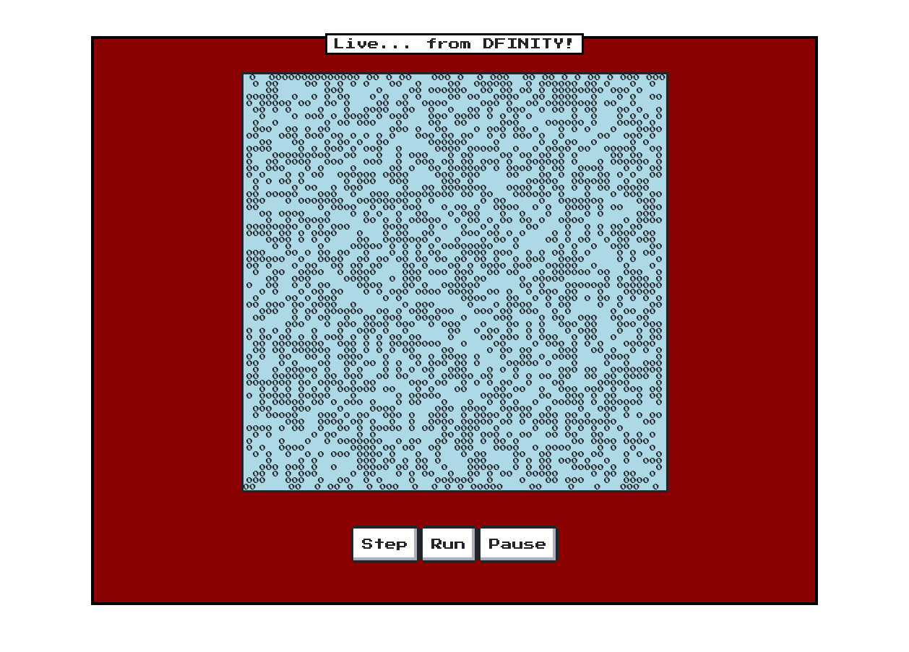

# Game of Life and Upgrades Example

This example contains a series of implementations of
[Conway's Game
of Life](https://en.wikipedia.org/wiki/Conway%27s_Game_of_Life).

Its main purpose is to demonstrate state-preserving upgrades using
Motoko's stable variables.  The implementations are meant to be
instructive and are not optimized for efficiency or to hide network
latency, which a production implementation would need to consider.

Our `src` directory containts the initial, version `v0`, implementation
but its contents will later be replaced with contents from directories `versions/v1` and
`versions/v2`. In a real project, with proper source control, there
might be a single `src` directory, with different versions of code
residing in different branches of the repository.

Directory `src` (version `v0`) contains an application with a very simple
React UI.

Directories `versions/v1` and `versions/v2` contain sequential
upgrades to `src` used to illustrate live upgrade by re-deployment of a
deployed canister.

(To make upgrades apparent, each version uses a different digit
 to display live cells (`0`,`1`,`2`))

## Initial deployment of Version `v0`

We start with version `v0` already checked out in
the `src` folder, and simply deploy it using `dfx`.

```bash
dfx deploy
```

The deployment step should report a canister id for the `life_assets`
canister.

1. Take note of the URL at which the `life_assets` is accessible.

   ```text
   echo "http://localhost:8000/?canisterId=$(dfx canister id life_assets)"
   ```

   Open the frontend in your browser by clicking on the link.

   You should see a frontend like this:
   
2. Click button `Step`. The grid will advance to the next generation of the Game of Life.
3. Click button `Run`. The grid will (slowly) animate sequential generations.
4. Click button `Pause`. The animation will pause.

Because the `v0` implementation makes no provision for upgrades, every
time you re-deploy the `v0` implementation, the grid will be
re-initialized to the same(pseudo-random) initial state.

The state of the grid is represented naively as a nested, mutable array of Boolean values:

[src/State.mo](./versions/src/life/State.mo):

```motoko
module {

  public type Cell = Bool;
  public type State = [[var Cell]];
  ...
}
```

A [src/life/grid](./src/life/Grid.mo) is represented as a simple class
constructed from, and maintaining, state. We omit the details here.

The main actor in [src/life/main](./src/life/main.mo) creates a
random state and maintains two grid objects, the current and
next grid (`cur` and `nxt`).
Life's `next()` method advances the Game of Life to the next generation by
updating `nxt` from `cur`, using Grid method call `cur.next(nxt)`.
The roles of `cur` and `nxt` are then swapped to re-use
`cur`'s space for the next generation (a simple
application of _double-buffering_).

[src/life/main.mo](./src/life/main.mo):

```Motoko
import Random = "Random";
import State = "State";
import Grid = "Grid";

actor Life {

  let state = do {
    let rand = Random.new();
    State.new(64, func (i, j) { rand.next() % 2 == 1 });
  };

  var cur = Grid.Grid(state);

  var nxt = Grid.Grid(State.new(cur.size(), func (i, j) { false; }));

  public func next() : async Text {
    cur.next(nxt);
    let temp = cur;
    cur := nxt;
    nxt := temp;
    cur.toText();
  };

  public query func current() : async Text {
    cur.toText()
  };

};
```

Note that none of the variables in this actor are declared `stable` so their values will not be preserved across upgrade, but re-initialized as on a fresh installation.

## Upgrade to Version `v1`

Version `v1` extends `v0` by declaring `state` as a `stable`, mutable
variable. It also adds a `preupgrade` system method that saves `cur`'s
current value to `state`,
and a trivial `postuprade` system method to log that an
upgrade has occurred.

[v1/life/main.mo](./versions/v1/life/main.mo):

```motoko
...
actor Life {

  stable var state =
    do {
      let rand = Random.new();
      State.new(64, func (i, j) { rand.next() % 2 == 1 });
    };

  system func preupgrade() {
    state := cur.toState();
  };

  system func postupgrade() {
    Debug.print("upgraded to v1!");
  };

  public query func stableState() : async Text {
    debug_show(cur.toState());
  };

  // ... remaining code from src/main.mo
};
```

The `v1` frontend also adds a simple `Details` UI element, hiding a `View State`
button, so you can inspect the representation of the Motoko stable
variable. This displays the result of calling query function `stableState()`.

In `v1` the state is just nested, mutable array of Boolean values, as used in `v0`, but tagged with variant label `#v1`. Introducing a variant type
now will accommodate future extension to other variants
(for example, when we upgrade to `v2`).

[v1/State.mo](./versions/v1/life/State.mo):

```motoko
module {

  public type Cell = Bool;

  public type State = {
    #v1 : [[var Cell]]
  };
  ...
}
```

To upgrade to the `v1` implementation, issue these commands:

```bash
mv src versions/v0
mv versions/v1 src
dfx deploy
```

1. Return to the same browser tab and refresh (or re-load the link).
2. Refresh the tab (if you want).  Note the current grid state is
   unchanged (thus preserved), apart from changing display character
   in grid.
3. Click button `Run`.
4. Click button `Pause` when bored.
5. Open `Details` and click `View State`.  Admire the `#v1` state on display.

After first ugrading from `v0` the state will be random, as on
deploying `v0`. This is because the `v0` code did not declare its `state` variable `stable`, forcing the upgraded actor to re-initialize `state` as no previous value for `state` is available in the retired actor.

However, if you re-deploy the `v1` project a second time, perhaps
after making a minor edit, you'll see the last state of the grid,
before deployment, preserved across the deployment, in a
state-preserving upgrade. The random initializer for `state` is
skipped and `state` just assumes the value it had before the upgrade.

## Upgrade to Version `v2`

Version `v2` upgrades `v1` by optimizing the representation of the
grid and its stable storage, using a more compact array of
`Nat64`s, that consumes just one bit, not a 32-bit `Bool` value,
per cell.

[v2/Life/State.mo](./versions/v2/life/State.mo):

```motoko
module {

  public type Cell = Bool;

  public type State = {
    #v1 : [[var Cell]];
    #v2 : {size : Nat; bits : [var Nat64]}
  };
  ...
}
```

Type `State` extends the original `#v1` representation with the compact `#v2` variant.
The `v1` representation is included so the code can read and migrate
a value in the original current `#v1` representation to a value in `#v2` format.
The `v2` version of the code always maintains its stable state in `#v2` format.

The implementation of the [v2/Life/Grid.mo](./versions/v2/life/Grid.mo) class needs some modification to operate on the compact representation,
but [v2/Life/main.mo](./versions/v2/life/main.mo) remains unchanged from `v1`.

```bash
mv src versions/v1
mv versions/v2 src
dfx deploy
```

1. Return to the same browser tab.
2. Refresh the tab (if you want).  Note the current grid state is
   unchanged (thus preserved), apart from changing the display character
   in the textual display of the grid.
3. Click button `Run`.
4. Click button `Pause` when bored.
5. Open `Details` and click `View State` and
   admire the compact, `#v2`, bit-vector on
   display.

For added fun, try modifying the code (changing the display
characters, say) and doing yet another upgrade.

## Selective Upgrades

`dfx deploy` will initially create, build and install all canisters in a project but, on subsequent calls, only re-build and _upgrade_ all canisters.

Another method to upgrade selective canisters is to manually call `dfx build <canister-name>` followed by `dfx canister install <canister-name> --mode upgrade`.

For example, our frontend canister, `life_assets`, hasn't changed from `v1` to `v2` so there's no real reason to re-deploy it on upgrade.
A faster alternative is to just upgrade the (backend) `life` canister:

```bash
dfx build life
dfx canister install life --mode upgrade
```

## More info

- [Stable variables and upgrade methods](https://sdk.dfinity.org/docs/language-guide/upgrades.html)
- [Manage Canisters](https://sdk.dfinity.org/docs/developers-guide/working-with-canisters.html)
- [Quick  Start](https://sdk.dfinity.org/developers-guide/quickstart.html)
- [Developer's Guide](https://sdk.dfinity.org/developers-guide)
- [Language Reference](https://sdk.dfinity.org/language-guide)
