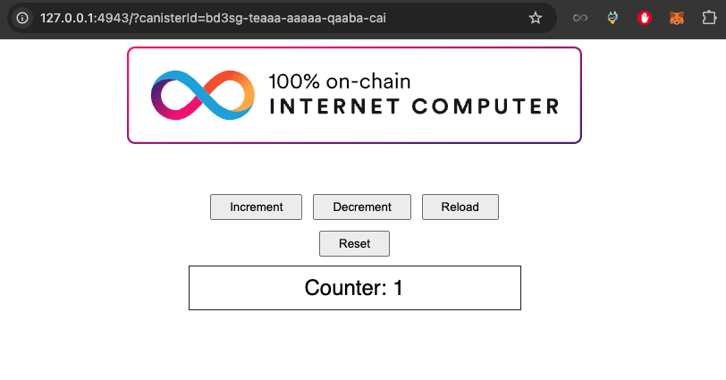
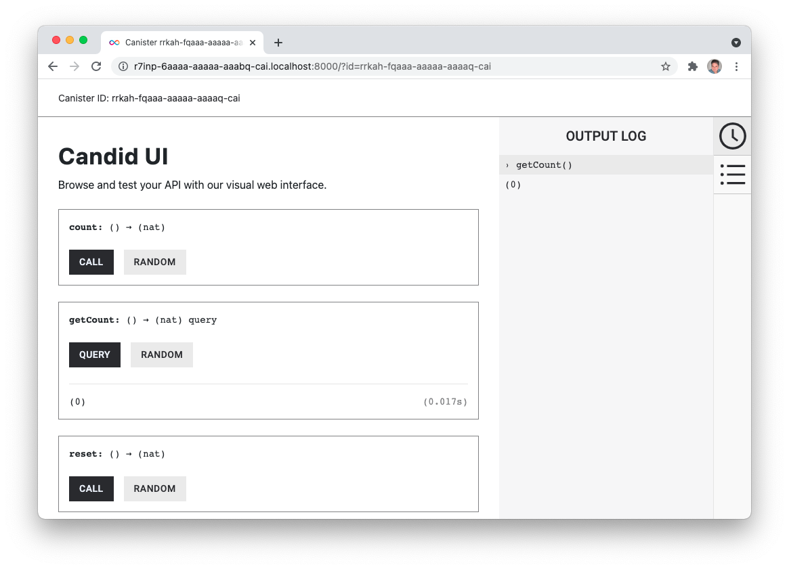

# Minimal counter dapp

[View this sample's code on GitHub](https://github.com/dfinity/examples/tree/master/motoko/minimal-counter-dapp)



## Overview

The example dapp shows how to build a very basic dapp with both backend and frontend, using Motoko for the backend functionality and plain HTML and JavaScript for the frontend. The dapp is a simple counter, which will increment a counter by clicking a button in the frontend.

The purpose of this example dapp is to build a minimalistic dapp, based on the default dapp template, installed by `dfx` when creating a new project. The dapp is a simple website with a counter. Every time a button is pressed, a counter is incremented.

This example covers:

- Create a new canister smart contract using the IC SDK (`dfx`).
- Use the default project as a template as the starting point for the new project.
- Add backend functions for a counter (count, get count, and reset count).
- Implement backend functions in the frontend.
- Deploy the canister smart contract locally.
- Test backend with Candid UI and command line using `dfx`, and test frontend in browser.

## Prerequisites

This example requires an installation of:

- [x] Install the [IC SDK](https://internetcomputer.org/docs/current/developer-docs/setup/install/index.mdx).
- [x] Install [Node.js](https://nodejs.org/en/download/).
- [x] Download and install [git.](https://git-scm.com/downloads)
- [ ] Clone the example dapp project: `git clone https://github.com/dfinity/examples`

Begin by opening a terminal window.

### Step 1: Navigate into the folder containing the project's files and start a local instance of the replica with the command:

```bash
cd examples/motoko/minimal-counter-dapp
npm install
dfx start --background
```

### Step 2: Build and deploy the canister:

```bash
dfx deploy
```

The output will resemble the following:

```bash
Deployed canisters.
URLs:
  Frontend canister via browser
    minimal_dapp_assets: http://127.0.0.1:4943/?canisterId=br5f7-7uaaa-aaaaa-qaaca-cai
  Backend canister via Candid interface:
    minimal_dapp: http://127.0.0.1:4943/?canisterId=bw4dl-smaaa-aaaaa-qaacq-cai&id=be2us-64aaa-aaaaa-qaabq-cai
```

### Step 3: Open the `minimal_dapp_assets` URL in a web browser.

You will see a GUI interface with a button that says **Click Me!** followed by a counter number. Each time the button is clicked, the counter value will increase by 1. 

## Architecture
The three main parts of the example dapp are the backend, the Candid interface, and the frontend. This example project is based on the default project, which is created when running the `dfx new project_name` command, but most of the default project code is replaced to create the counter functionality in this project.

### Motoko backend
The backend functions are located in the `src/minimal_dapp/main.mo` Motoko file. The backend stores the counter value and has functions to get, increment, and reset the counter value.


#### Counter variable
Three functions are created to make the counter work: `count()`, `getCount()` and `reset()`. The current counter value is stored as a number in the actor.


```javascript
actor {
    var counter : Nat = 0;
}
```

#### count()
The `count()` function increments the counter variable. This function is invoked when the user clicks the button on the frontend, or when the function is called through the Candid interface.

```javascript
public func count() : async Nat {
    counter += 1;
    return counter;
};
```

The function returns the incremented counter variable.

#### getCount()
The `getCount()` function returns the current counter value.

```javascript
public query func getCount() : async Nat {
    return counter;
};
```

#### reset()
The `reset()` function resets the counter value to 0 and returns the value.

```javascript
public func reset() : async Nat {
    counter := 0;
    return counter;
};
```

### Candid interface
The Candid interface is automatically created, and it has a convenient UI, which provides an easy, user-friendly way to test the backend. Learn how to access the Candid UI in the **Testing** section below. 

### Frontend
The default project installed with `dfx new project_name` has an `index.html` file with page HTML and an `index.js` file with an implementation of the backend functions. These two files are modified in this example project to support the counter functionality and the backend functions.

#### HTML
All HTML code is in the `src/minimal_dapp_assets/src/index.html` file, and most of the HTML is carried over from the default project. The button is kept and so is the section showing the result, just simplified.

```html
<!doctype html>
<html lang="en">
    <head>
        <meta charset="UTF-8">
        <meta name="viewport" content="width=device-width">
        <title>Minimal Dapp</title>
        <base href="/">

        <link type="text/css" rel="stylesheet" href="main.css" />
    </head>
    <body>
        
        <section>
            <button id="clickMeBtn">Click Me!</button>
        </section>
        <section id="counter"></section>
    </body>
</html>
```

#### Javascript
Two `eventlisteners` are added to the JavaScript file, `src/minimal_dapp_assets/src/index.js`, the existing JavaScript file from the default project. One `eventlistener` is for detecting button clicks, and it's calling the `count()` function in the backend, and an `eventlistener` for page load is added to get the initial value of the counter with `getCount()`. The backend functions are imported through the Candid interface.

```javascript
import { minimal_dapp } from "../../declarations/minimal_dapp";

document.addEventListener("DOMContentLoaded", async () => {
  const counter = await minimal_dapp.getCount();
  document.getElementById("counter").innerText = "Counter: " + counter;
});

document.getElementById("clickMeBtn").addEventListener("click", async () => {
  const counter = await minimal_dapp.count();
  document.getElementById("counter").innerText = "Counter: " + counter;
});
```

#### `dfx`
`dfx` has a subset of commands for canister operations, and one of them enables calling the public functions added to the `main.mo` file in the previous step. In the following examples the initial value is 0. `count` will increment value and return 1, `getCount` will return the current value, and `reset` will set the value to 0.

Command usage: `dfx canister call <project>  <function>`

```bash
$ dfx canister call minimal_dapp count
(1 : Nat)
```

```bash
$ dfx canister call minimal_dapp getCount
(1 : Nat)
```

```bash
$ dfx canister call minimal_dapp reset
(0 : Nat)
```

#### Candid UI
The Candid interface is automatically created, and it has a convenient UI, which provides an easy, user-friendly way to test the backend. The UI is also automatically generated, and the canister ID can be retrieved from the `dfx canister id <canister_name>` command.

```bash
$ dfx canister id __Candid_UI
r7inp-6aaaa-aaaaa-aaabq-cai
$ dfx canister id minimal_dapp
rrkah-fqaaa-aaaaa-aaaaq-cai
```

**http://\{candid_canister_id\}.localhost:8000/?id=\<backend_canister_id\>**



## License
This project is licensed under the Apache 2.0 license, see LICENSE.md for details. See CONTRIBUTE.md for details about how to contribute to this project.

## Security considerations and best practices

If you base your application on this example, we recommend you familiarize yourself with and adhere to the [security best practices](https://internetcomputer.org/docs/current/references/security/) for developing on the Internet Computer. This example may not implement all the best practices.

For example, the following aspects are particularly relevant for this app:
* [Use HTTP asset certification and avoid serving your dApp through raw.ic0.app](https://internetcomputer.org/docs/current/references/security/rust-canister-development-security-best-practices#use-http-asset-certification-and-avoid-serving-your-dapp-through-rawic0app), since this app serves a frontend. 
* [Certify query responses if they are relevant for security](https://internetcomputer.org/docs/current/references/security/general-security-best-practices#certify-query-responses-if-they-are-relevant-for-security), since this app uses query calls.
