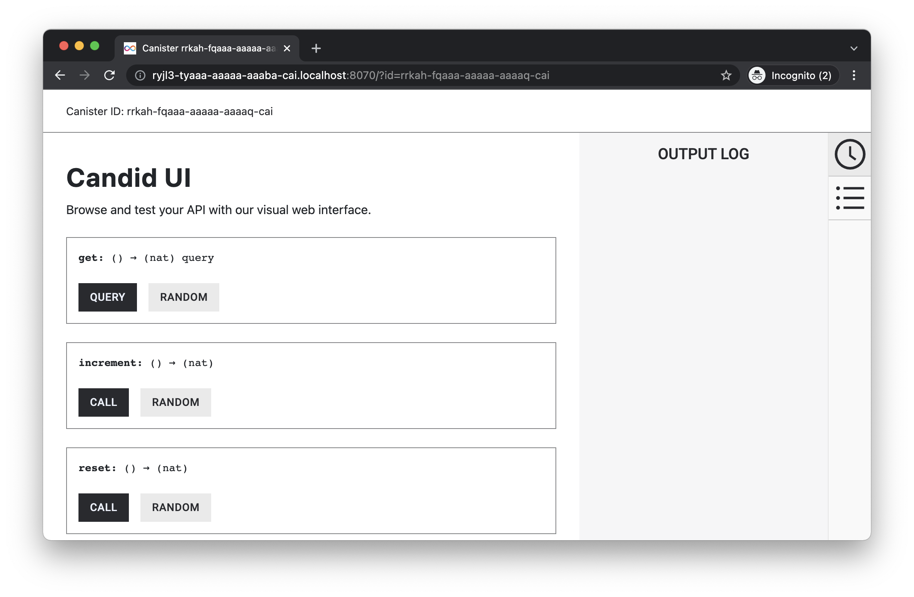

# Persistent storage

[View this sample's code on GitHub](https://github.com/dfinity/examples/tree/master/motoko/persistent-storage)

## Overview
The example dapp shows how to build a simple dapp in Motoko, which will have persistent storage. The dapp is a simple counter, which will increment a counter, retrieve the counter value and reset the counter value by calling backend functions. The functions are exposed through a Candid interface.



The purpose of this example dapp is to build a simple counter dapp, where the counter value will persist even after the dapp has changed and been redeployed.

This example covers:

- Create a new canister smart contract using Motoko.
- Add backend functions for a counter (increment, get count, and reset count).
- Deploy the canister smart contract locally.
- Test the backend with Candid UI and command line using `dfx`.


## Installation
This example project can be cloned, installed, and deployed locally, for learning and testing purposes. The instructions are based on running the example on either macOS or Linux, but when using WSL2 on Windows, the instructions will be the same.

### Prerequisites
This example requires an installation of:

- [x] Install the [IC SDK](https://internetcomputer.org/docs/current/developer-docs/setup/install/index.mdx).
- [x] Download and install [git.](https://git-scm.com/downloads)
- [x] Clone the example dapp project: `git clone https://github.com/dfinity/examples`

Begin by opening a terminal window.

### Step 1: Navigate into the folder containing the project's files and start a local instance of the Internet Computer with the command:

```bash
cd examples/motoko/persistent-storage
dfx start --background
```

### Step 2: Build and deploy the canister:

```bash
dfx deploy
```

### Step 3: Command usage: `dfx canister call <project>  <function>`

```bash
dfx canister call persistent_storage increment
```

Output:

```bash
(1 : Nat)
```

```bash
dfx canister call persistent_storage get
```

Output:

```bash
(1 : Nat)
```

```bash
dfx canister call persistent_storage reset
```

Output:

```bash
(0 : Nat)
```

The persistence of the stored value can be tested by calling the `increment` function again and making sure the value is larger than zero. Then make a change in the Motoko code, any minor change like changing the function name `get` to `getCount`, and then re-deploy the project and call the `getCount` function to verify that the counter value did not change back to the initial value (0).

```bash
$ dfx canister call persistent_storage increment
(1 : Nat)
// Make code change
$ dfx deploy
$ dfx canister call persistent_storage getCount
(1 : Nat)
```

## Architecture
The two main parts of the example dapp are the backend and the Candid interface. This example project does not have a frontend.

### Motoko backend
The backend functions are located in the `src/persistent_storage/main.mo` Motoko file. The backend stores the counter value and has functions to get, increment, and reset the counter value. Furthermore, the backend ensures the counter value persists in upgrades of the dapp.

#### Counter variable
The current counter value is stored as a number in the actor.

```javascript
actor {
    stable var counter : Nat = 0;
}
```

#### increment()
The `increment()` function increments the counter variable.

```javascript
public func increment() : async Nat {
    counter += 1;
    return counter;
};
```

The function returns the incremented counter variable.

#### get()
The `get()` function returns the current counter value.

```javascript
public query func get() : async Nat {
    return counter;
};
```

#### reset()
The `reset()` function resets the counter value to 0 and returns the value.

```javascript
public func reset() : async Nat {
    counter := 0;
    return counter;
};
```

### Candid interface
The Candid UI provides an easy, user-friendly interface for testing the backend. The UI is automatically generated, and the canister ID can be found by using the `dfx canister id <canister_name>` command:

```bash
$ dfx canister id __Candid_UI
r7inp-6aaaa-aaaaa-aaabq-cai
$ dfx canister id persistent_storage
rrkah-fqaaa-aaaaa-aaaaq-cai
```

```
http://<candid_canister_id>.localhost:8000/?id=<backend_canister_id>
```

## License
This project is licensed under the Apache 2.0 license, see LICENSE.md for details. See CONTRIBUTE.md for details about how to contribute to this project.


## Security considerations and best practices

If you base your application on this example, we recommend you familiarize yourself with and adhere to the [Security Best Practices](https://internetcomputer.org/docs/current/references/security/) for developing on the Internet Computer. This example may not implement all the best practices.

For example, the following aspects are particularly relevant for this app:
* [Consider using stable memory, version it, test it](https://internetcomputer.org/docs/current/references/security/rust-canister-development-security-best-practices#consider-using-stable-memory-version-it-test-it), since this canister uses stable memory. 
* [Certify query responses if they are relevant for security](https://internetcomputer.org/docs/current/references/security/general-security-best-practices#certify-query-responses-if-they-are-relevant-for-security), since this canister provides query calls.
