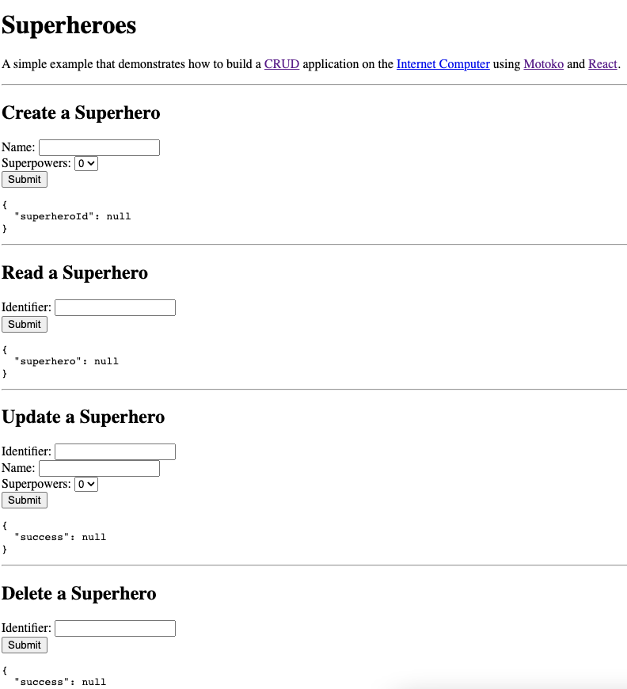

## Superheroes


[](https://github.com/dfinity/examples/actions?query=workflow%3Amotoko-superheroes-example)

## Overview

This example demonstrates how to build a CRUD application on the Internet Computer using Motoko and React.

This is a Motoko example that does not currently have a Rust variant. 

## Prerequisites
This example requires an installation of:

- [x] Install the [IC SDK](https://internetcomputer.org/docs/current/developer-docs/setup/install/index.mdx).

Begin by opening a terminal window.

### Step 1: Navigate into the folder containing the project's files and start a local instance of the Internet Computer with the command:

```
cd examples/motoko/superheros
dfx start --background
```

### Step 2: Build the front-end of the application:

```
npm install
``` 

### Step 3: Deploy the canister:

```
dfx deploy
```

### Step 4: Take note of the URL at which the canister is accessible.

```
echo "http://127.0.0.1:4943/?canisterId=$(dfx canister id www)"
```

### Step 5: Open the aforementioned URL in your web browser.
You will see the following interface that you can interact with:



## Security considerations and security best practices

If you base your application on this example, we recommend you familiarize yourself with and adhere to the [security best practices](https://internetcomputer.org/docs/current/references/security/) for developing on the Internet Computer. This example may not implement all the best practices.

For example, the following aspects are particularly relevant for this app:
* [Use HTTP asset certification and avoid serving your dApp through raw.ic0.app](https://internetcomputer.org/docs/current/references/security/rust-canister-development-security-best-practices#use-http-asset-certification-and-avoid-serving-your-dapp-through-rawic0app), since this app serves a frontend.
* [Certify query responses if they are relevant for security](https://internetcomputer.org/docs/current/references/security/general-security-best-practices#certify-query-responses-if-they-are-relevant-for-security), since this app uses query calls.

