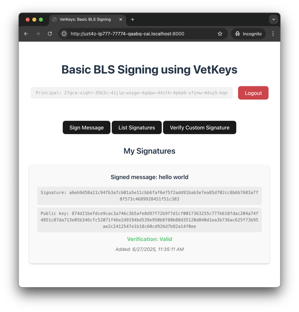

# Threshold BLS Signatures (Motoko)

[View this sample's code on GitHub](https://github.com/dfinity/examples/tree/master/motoko/vetkeys/basic_bls_signing)

Also available in: [Rust](../../../rust/vetkeys/basic_bls_signing)

The **Basic BLS signing** example demonstrates how to use **[VetKeys](https://docs.internetcomputer.org/concepts/vetkeys)** to implement a threshold BLS signing service on the **Internet Computer (IC)**, where every authenticated user can ask the canister (IC smart contract) to produce signatures, with the **Internet Identity Principal** identifying the signer. The canister ensures a user can only produce signatures for their own principal, not for someone else's. Furthermore, the vetKeys in this dapp can only be produced upon a user request, as specified in the canister code — the canister cannot produce signatures for arbitrary users or messages.

To confirm the canister can only produce signatures in the intended way, users need to inspect the code installed in the canister. For this, it is crucial that canisters using VetKeys have their code public.



## Features

- **Signer Authorization**: Only authorized users can produce signatures, and only for their own identity.
- **Frontend Signature Verification**: Any user can publish a signature from their principal in the canister storage, and the frontend automatically checks its validity.

## Build and deploy from the command line

### Prerequisites

- Install [Node.js](https://nodejs.org/en/download/)
- Install [icp-cli](https://cli.internetcomputer.org): `npm install -g @icp-sdk/icp-cli @icp-sdk/ic-wasm`
- Install [ic-mops](https://mops.one): `npm install -g ic-mops`

### (Optionally) choose a different master key

This example uses `test_key_1` by default. To use a different [available master key](https://docs.internetcomputer.org/concepts/vetkeys/#api-overview), change the `init_args` value in `icp.yaml` before deploying.

### Install

```bash
git clone https://github.com/dfinity/examples
cd examples/motoko/vetkeys/basic_bls_signing
```

### Deploy

```bash
icp network start -d
icp deploy
```

Open the frontend URL printed by `icp deploy`.

To run the frontend in development mode with hot reloading (after `icp deploy`):

```bash
npm run dev
```

When done, stop the local network to free up the port for other projects:

```bash
icp network stop
```

## Example components

### Backend (`backend/`)

A single Motoko canister that:
- Produces BLS signatures upon a user request.
- Lets users retrieve the public key used to verify their signatures.
- Lets users store signatures (real or fake) in a log data structure.

### Frontend (`frontend/`)

A vanilla TypeScript application providing a simple interface for signing, showing the signatures stored in the canister, and verifying a signature. Canister bindings are generated from `backend/backend.did` at build time by the `@icp-sdk/bindgen` Vite plugin.

## Updating the Candid interface

`backend/backend.did` defines the backend's public interface; the frontend bindings are generated from it during the build. If you change the backend's public API, regenerate it:

```bash
mops generate candid backend
```

## Additional resources

- **[What are VetKeys](https://docs.internetcomputer.org/concepts/vetkeys)** — more information about VetKeys and VetKD.
- [Security best practices](https://docs.internetcomputer.org/guides/security/overview)
