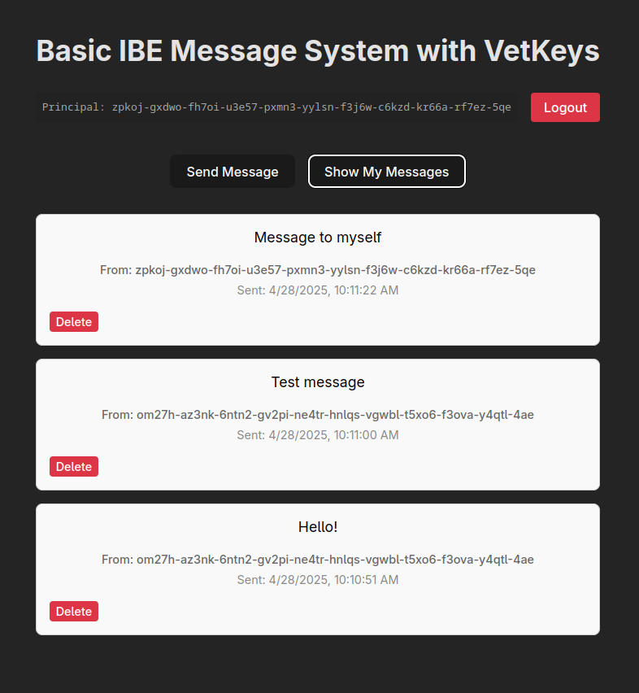

# Identity-Based Encryption (Motoko)

[View this sample's code on GitHub](https://github.com/dfinity/examples/tree/master/motoko/vetkeys/basic_ibe)

Also available in: [Rust](../../../rust/vetkeys/basic_ibe)

The **Basic IBE** example demonstrates how to use **[VetKeys](https://docs.internetcomputer.org/concepts/vetkeys)** to implement secure messaging between users by means of Identity-Based Encryption (IBE) on the **Internet Computer (IC)**. Users send encrypted messages to other users using their **Internet Identity Principal** as the encryption key identifier. The canister (IC smart contract) ensures that only the authorized user can access their private decryption key — even if someone else knows your principal, they cannot decrypt messages intended for you, because neither other users nor this canister can access your private key.

Note that generally it is possible for a canister to request a decryption key to decrypt secrets as part of its code. However, doing so requires the canister to provide its own transport key instead of requesting a user's transport key, and this inherently makes the secrets public. Such functionality can be detected by inspecting the code, so it is crucial that canisters using VetKeys have their code public to allow verifying that the canister handles secrets in a secure way.



## Features

- **Secure Messaging**: Uses the IBE capabilities of IC VetKeys to encrypt messages that can only be decrypted by the intended recipient.
- **Principal-Based Encryption**: Messages are encrypted using the recipient's principal as the public key identifier.
- **Private Key Management**: Each user's private decryption key is generated by the VetKD protocol and encrypted using the user's transport key, making it inaccessible to the canister itself. The canister only sees the keys in encrypted form and forwards them to the authorized users.

## Build and deploy from the command line

### Prerequisites

- Install [Node.js](https://nodejs.org/en/download/)
- Install [icp-cli](https://cli.internetcomputer.org): `npm install -g @icp-sdk/icp-cli @icp-sdk/ic-wasm`
- Install [ic-mops](https://mops.one): `npm install -g ic-mops`

### (Optionally) choose a different master key

This example uses `test_key_1` by default. To use a different [available master key](https://docs.internetcomputer.org/concepts/vetkeys/#api-overview), change the `init_args` value in `icp.yaml` before deploying.

### Install

```bash
git clone https://github.com/dfinity/examples
cd examples/motoko/vetkeys/basic_ibe
```

### Deploy

```bash
icp network start -d
icp deploy
```

Open the frontend URL printed by `icp deploy`.

To run the frontend in development mode with hot reloading (after `icp deploy`):

```bash
npm run dev
```

When done, stop the local network to free up the port for other projects:

```bash
icp network stop
```

## Example components

### Backend (`backend/`)

A single Motoko canister that:
- Stores encrypted messages between users.
- Lets users retrieve their personal encrypted messages.
- Lets users retrieve the decryption key for their messages, for later decryption in the user's browser.

### Frontend (`frontend/`)

A vanilla TypeScript application providing a simple interface for sending, receiving, and deleting encrypted messages. Canister bindings are generated from `backend/backend.did` at build time by the `@icp-sdk/bindgen` Vite plugin.

## Updating the Candid interface

`backend/backend.did` defines the backend's public interface; the frontend bindings are generated from it during the build. If you change the backend's public API, regenerate it:

```bash
mops generate candid backend
```

## Limitations

This example dapp does not implement key rotation, which is strongly recommended in a production dapp to limit the impact of a potential key compromise if a malicious party gains access to a user's decryption key.

## Additional resources

- **[What are VetKeys](https://docs.internetcomputer.org/concepts/vetkeys)** — more information about VetKeys and VetKD.
- [Security best practices](https://docs.internetcomputer.org/guides/security/overview)
