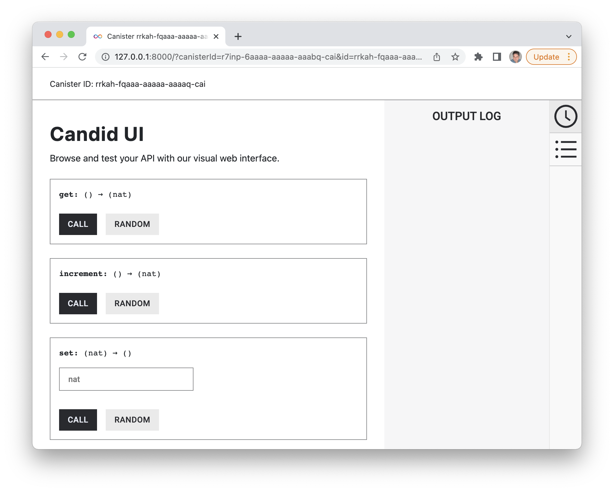

# Persistent Storage
The example dapp shows how to build a simple dapp in Rust, which will have persistent storage. The dapp is a very basic dapp with both backend and fronted, using Rust for the backend functionality and plain HTML and JavaScript for the frontend. The dapp is a simple counter, which will increment a counter by clicking a button in the frontend. 


## Introduction
The purpuse of this example dapp is to build a minimalistic dapp, with persistent storage, based on the default dapp template installed by DFX when creating a new project. The dapp is a simple website with a counter. Every time a button is pressed, a counter is incremented. 

This example covers:

- Create new canister smart contract using the SDK (DFX)
- Use the default project as a template as the starting point for the new project
- Add backend functions for a counter (count, get count and set count)
- Implement backend functions in the frontend
- Deploy the canister smart contract locally
- Test backend with Candid UI and command line using DFX, and test frontend in browser 

## Installation
This example project can be cloned, installed and deployed locally, for learning and testing purposes. The instructions are based on running the example on either macOS or Linux, but when using WSL2 on Windows, the instructions will be the same.

### Prerequisites
The example project requeres the following installed:

- GitHub
- Node.js
- DFX 

GitHub and Node can be installed from various package managers. DFX can be installed following the instructions [here](https://smartcontracts.org/docs/quickstart/local-quickstart.html#download-and-install).

### Install
Install the example dapp project:

```bash
$ git clone https://github.com/dfinity/examples
$ cd rust/minimal-counter-dapp
$ npm install
```

## Documentation
The three main parts of the example dapp is the backend, the Candid interface and the frontend. This example project is based on the default project, which is created when running the `dfx new --type=rust project_name`, but most of the default project code is replaced to create the counter functionality in this project.

### Rust backend
The backend functions are located in the `src/minimal_rust_dapp/lib.rs` Rust file. The backend stores the counter value, and has functions to get, increment and reset the counter value.


#### Counter variable
Three functions are created to make the counter work: increment(), get() and set(). The current counter value is stored as a number.


```rust
thread_local! {
    static COUNTER: RefCell<candid::Nat> = RefCell::new(candid::Nat::from(0));
}
```

#### increment()
The `increment()` function increments the counter variable. This function is envoked when the user is clicking the button on the frontend, or when the function is called through the Candid interface.

```rust
#[update]
fn increment() -> candid::Nat {
    COUNTER.with(|counter| {
        *counter.borrow_mut() += 1u64;
    });

    COUNTER.with(|counter| counter.borrow().clone())
}
```

The function is returning the incremented counter value.

#### get()
The `get()` function returns the current counter value.

```rust
#[query]
fn get() -> candid::Nat {
    COUNTER.with(|counter| counter.borrow().clone())
}
```

#### set()
The `set()` function resets the counter value to 0 and returns the value.

```rust
#[update]
fn set(input: candid::Nat) -> () {
    COUNTER.with(|counter| {
        *counter.borrow_mut() = input;
    })
}
```

### Candid interface
The Candid interface is automatically created, and it has a convienient UI, which provides an easy, user friendly way to test the backend. The UI is also automatically generated, and the canister ID can be found in the `canister_ids.json` file. 

The localhost version of the `canister_ids.json` file can be found in `.dfx/local/canister_ids.json` and the URL is: 

**http://<candid_canister_id>.localhost:8000/?id=<backend_canister_id>**


### Frontend
The default project installed with `dfx new project_name` has an `index.html` file with page HTML and an `index.js` file with an implementation of the backend functions. These two files are modified in this example project to support the counter functionality, and the backend functions.

#### HTML
All HTML code is in the `src/minimal_counter_dapp/_assets/index.html` file, and most of the HTML is carried over from the default project. The button is kept and so is the section showing the result, just simplified.

```html
<!doctype html>
<html lang="en">
    <head>
        <meta charset="UTF-8">
        <meta name="viewport" content="width=device-width">
        <title>hack</title>
        <base href="/">

        <link type="text/css" rel="stylesheet" href="main.css" />
    </head>
    <body>
        
        <section>
            <button id="clickMeBtn">Click Me!</button>
        </section>
        <section id="counter"></section>
    </body>
</html>
```

#### Javascript
Two eventlisteners are added to the JavaScript file, `src/minimal_counter_dapp/_assets/index.js`, the existing JavaScript file from the default project. One eventlistener is for detecting button clicks, and it's calling the `increment()` function in the backend, and an eventlistener for page load is added to get the initial value of the counter with `get()`. The backend functions are imported through the Candid interface.

```javascript
import { minimal_counter_dapp } from "../../declarations/minimal_counter_dapp";

document.addEventListener('DOMContentLoaded', async function () {
  const counter = await minimal_counter_dapp.get();
  document.getElementById("counter").innerText = "Counter: " + counter;
})

document.getElementById("clickMeBtn").addEventListener("click", async () => {
  const counter = await minimal_counter_dapp.increment();
  document.getElementById("counter").innerText = "Counter: " + counter;
});
```


## Deployment
The local network is started by running this command:

```bash
$ dfx start --background
```

When the local network is up and running, run this command to deploy the canisters:

```bash
$ dfx deploy
```


## Testing
The functionality of this example dapp can be tested both in the frontend and in the backend. Before the example dapp can be tested, it must be deployed (locally) like described in the above Deployment section. 

### Test the Frontend
The URL for the frontend is depending on the canister ID, the local canister IDs can be found in `.dfx/local/canister_ids.json`. When deployed, the URL will look like this:

**https://<ui_canister_id>.localhost:8000**

### Test the backend
There are two ways of testing the backend. One way is by making command line requests using DFX, and the other way is to use the Candid UI.

#### DFX
DFX has a subset of commands for canister operations, and one of them enables calling the public functions added to the `main.mo` file in the previous step. In the following examples the initial value is 0. `increment` will increment value and return 1, `get` will return the current value and `set` will set the value to the value passed to the function.

Command usage: `dfx canister call &#60project&#62  &#60function&#62`

```bash
$ dfx canister call minimal_counter_dapp increment
(1 : Nat)
```

```bash
$ dfx canister call minimal_counter_dapp get
(1 : Nat)
```

```bash
$ dfx canister call minimal_counter_dapp set '(0)'
()
```

#### Candid UI
The Candid UI provides an easy, user friendly interface for testing the backend. The UI is automatically generated, and the canister ID can be found in the `canister_ids.json` file. 

The localhost version of the `canister_ids.json` file can be found in `.dfx/local/canister_ids.json` and the URL is: 

**http://<candid_canister_id>.localhost:8000/?id=<backend_canister_id>**



## License
This project is licensed under the Apache 2.0 license, see LICENSE.md for details. See CONTRIBUTE.md for details about how to contribute to this project. 
