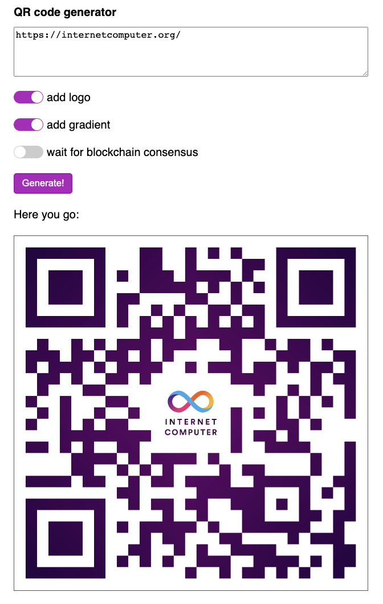

# QR code generator

[View this sample's code on GitHub](https://github.com/dfinity/examples/tree/master/rust/qrcode)

## Overview

This example shows that an Internet Computer dapp can perform a long-running computation, like image processing, in a single message execution.
This is possible due to a unique feature called Deterministic Time Slicing (DTS), which automatically divides long computations into smaller slices executed across multiple blocks.
Developers can write long-running code as usual and don't require anything special to take advantage of DTS, as demonstrated in this example.

You try the live version of the dapp running on the mainnet here: [https://khpe2-4qaaa-aaaao-a2fnq-cai.icp0.io/](https://khpe2-4qaaa-aaaao-a2fnq-cai.icp0.io/).

## Prerequisites
This example requires an installation of:

- [x] Install the [IC SDK](https://internetcomputer.org/docs/current/developer-docs/setup/install/).
- [x] Install `node.js` to build the web frontend. Make sure the version is at least `12.20`.
- [x] Make sure your rust version is up-to-date (e.g., run `rustup update`).
- [x] Add the `wasm32` target to your rust installation (by running `rustup target add wasm32-unknown-unknown`).
- [x] Clone this project to a local directory.
- [x] Install `node.js` dependencies by running `npm install`.
- [x] Clone the example dapp project: `git clone https://github.com/dfinity/examples`

## Running locally

Start a local replica of the Internet Computer by running:

```bash
dfx start --background
```

You can omit the `--background` argument if you want to see log messages of the dapp.

Now you can build and deploy the dapp with a single command:

```bash
dfx deploy
```

If you see any error, it might be worthwhile to consult the [developer forum](https://forum.dfinity.org/).
In case of successful deployment, you will see an output with local URLs:

```bash
Deployed canisters.
URLs:
  Frontend canister via browser
    qrcode_frontend: ...
  Backend canister via Candid interface:
    qrcode_backend: ...
```

Navigate to the frontend URL in your browser and you'll be able to interact with the dapp.




## How it works

The initial code of the dapp was autogenerated by `dfx` using the standard frontend/backend template.

The frontend consists of an HTML page with a form where users can enter text for the QR code and choose various options.
When the user clicks the "Generate!" button, a JavaScript handler initiates a call to the backend canister.
The heavy lifting of this call is managed by `candid`, `js-agent`, and `dfx`, which automatically generates a JavaScript object from the backend's Candid interface.
That object contains `async` functions for each of the backend's endpoints, and the button handler uses them to make the calls.

The backend, written in Rust, uses the `qrcode-generator` and `image` crates to create a QR code from user text.
It also performs some image processing, to add the Internet Computer logo and a color gradient to the final result.
Note the amount of computational work may be significant for large images.

For educational purposes, the backend offers two public endpoints for QR code generation: one for updates and another for queries.
Currently, DTS is supported for updates, but not for queries.
As a result, the update endpoint has a larger instruction limit compared to the query endpoint and thus can handle larger images.

