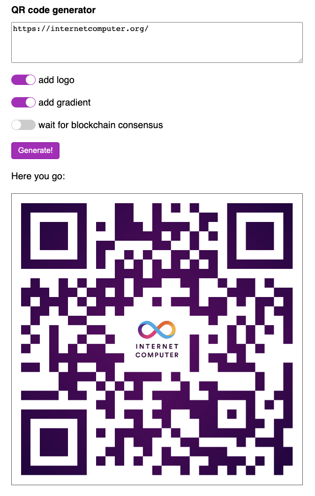

# QR code generator

This example shows that an Internet Computer dapp can perform a long-running computation, like image processing, in a single message execution.
This is possible due to a unique feature called Deterministic Time Slicing (DTS), which automatically divides long computations into smaller slices executed across multiple blocks.
Developers can write long-running code as usual and don't require anything special to take advantage of DTS, as demonstrated in this example.

You can try the live version of the dapp running on the mainnet here: [https://khpe2-4qaaa-aaaao-a2fnq-cai.icp0.io/](https://khpe2-4qaaa-aaaao-a2fnq-cai.icp0.io/).

## How it works

The frontend consists of an HTML page with a form where users can enter text for the QR code and choose various options.
When the user clicks the "Generate!" button, a JavaScript handler initiates a call to the backend canister.

The backend, written in Rust, uses the `qrcode-generator` and `image` crates to create a QR code from user text.
It also performs some image processing to add the Internet Computer logo and a color gradient to the final result.
Note that the amount of computational work may be significant for large images.

For educational purposes, the backend offers two public endpoints for QR code generation: one for updates and another for queries.
Currently, DTS is supported for updates, but not for queries.
As a result, the update endpoint has a larger instruction limit compared to the query endpoint and thus can handle larger images.

## Build and deploy from the command line

### Prerequisites

- Node.js
- icp-cli: `npm install -g @icp-sdk/icp-cli @icp-sdk/ic-wasm`
- Rust with the `wasm32-unknown-unknown` target: `rustup target add wasm32-unknown-unknown`

### Install

```bash
git clone https://github.com/dfinity/examples
cd examples/rust/qrcode
```

### Deploy and test

```bash
icp network start -d
icp deploy
make test
icp network stop
```

If you want to interact with the frontend during development, run the Vite dev server for hot reload:

```bash
npm run dev --prefix frontend
```

Navigate to the frontend URL in your browser and you'll be able to interact with the dapp.



## Security considerations and best practices

If you base your application on this example, it is recommended that you familiarize yourself with and adhere to the [security best practices](https://docs.internetcomputer.org/guides/security/overview) for developing on ICP. This example may not implement all the best practices.
